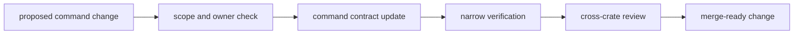

# Operations

Open this section when the question is how to change `bijux-gnss` without
quietly moving command meaning, widening public contracts carelessly, or
breaking top-level workflow composition.

## Operational Model

## Read These First

- open [Foundation](../foundation/) first if the change may belong in another
  crate
- stay in this section when the ownership is clear and the real question is
  how to edit the command boundary safely

## First Proof Check

- `crates/bijux-gnss/README.md`
- `crates/bijux-gnss/docs/TESTS.md`
- `crates/bijux-gnss/tests/`
