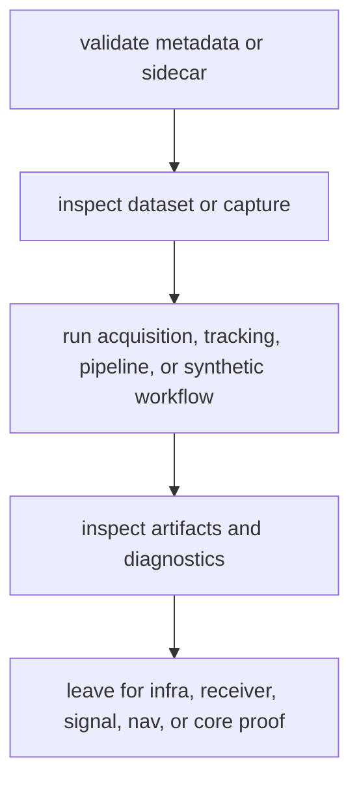

# Operator Journeys

Operator journeys describe how a human moves through the command tree. They do
not prove receiver math, dataset persistence, signal behavior, or navigation
science. They tell the reader which command route comes next and which crate
owns the next proof.

## Ingest-To-Evidence Journey

| step | command-facing surface | lower proof owner |
| --- | --- | --- |
| validate capture metadata | sidecar and validation command routes | `bijux-gnss-infra`, `bijux-gnss-signal` |
| inspect a dataset or raw-IQ capture | inspect and dataset-facing helpers | `bijux-gnss-infra` |
| run acquisition or tracking | `acquire`, `track`, pipeline commands | `bijux-gnss-receiver`, `bijux-gnss-signal` |
| solve or validate navigation | `nav`, `pvt`, `rtk`, synthetic navigation routes | `bijux-gnss-nav`, `bijux-gnss-core` |
| explain outputs | artifact and diagnostics routes | `bijux-gnss-core`, `bijux-gnss-infra`, `bijux-gnss-receiver` |

## Journey Rules

- Keep operator journeys in command language: verbs, inputs, outputs, and
  next commands.
- Hand off immediately when the reader needs stage internals, persisted layout,
  signal math, or navigation science.
- Do not describe one "happy path" as if it proves all workflows; name the
  artifact or diagnostic surface that proves each route.
- If a command route gains a new output, update the journey and the owning
  contract page in the same change.

## Common Detours

- A metadata failure detours to infra dataset and sidecar contracts.
- A code, carrier, or sample mismatch detours to signal contracts.
- A degraded acquisition, tracking, or observation result detours to receiver
  diagnostics and stage contracts.
- A solver refusal, PPP downgrade, or RTK quality issue detours to navigation
  estimation contracts.

## First Proof Check

Inspect `crates/bijux-gnss/docs/COMMANDS.md`,
`crates/bijux-gnss/docs/WORKFLOWS.md`,
`crates/bijux-gnss/src/cli/commands/`, and the lower crate named by the journey
step.
