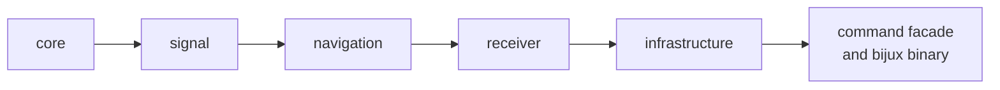
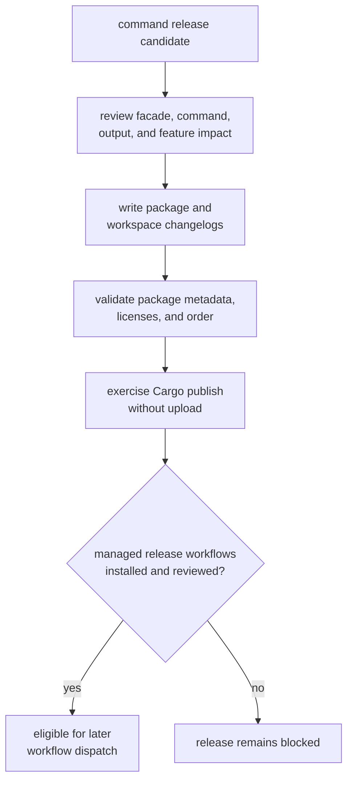

# Releasing the Command Facade

The command package is both the Rust facade and the source of the `bijux`
binary. It publishes last because it depends on the other public GNSS
packages. Release review must cover Rust callers, operator behavior, output
meaning, feature selection, and package metadata before any publication
workflow is triggered.

This page prepares a release. It does not authorize or perform one.

## Publication Position

The [release contract](../../../configs/release/crates.toml) includes the
command package in the six-package public allowlist. All public packages share
one workspace version and publish in dependency order; the command facade is
last.



The binary is included by the command package and requires the `cli` feature.
The default feature set also enables precise-product workflows. Feature
changes can therefore alter both registry consumers and the installed command,
even when no command name changes.

## Classify Compatibility

| Changed surface | Release impact |
| --- | --- |
| Public facade export | Rust API compatibility; review downstream imports and feature availability |
| Command name, argument, default, or accepted value | operator and automation compatibility |
| Exit status or refusal behavior | shell, CI, and workflow compatibility |
| Human-readable rendering | operator interpretation; call out changed terminology or omitted evidence |
| JSON, YAML, report, or validation output | machine-readable and persisted contract compatibility |
| Default feature or optional dependency | build shape, binary capability, and downstream dependency compatibility |
| Delegation to receiver, navigation, or infrastructure | workflow behavior; include the owning package’s evidence and changelog |

A scientifically correct lower-level change can still be breaking at the
command boundary if defaults, output fields, refusal, or exit behavior move.

## Build Release Confidence



Use the [command contracts](../../../crates/bijux-gnss/docs/COMMANDS.md),
[reporting contract](../../../crates/bijux-gnss/docs/REPORTING.md), and
[validation contract](../../../crates/bijux-gnss/docs/VALIDATION.md) to locate
the user-visible meaning. Review the
[public facade](../../../crates/bijux-gnss/src/lib.rs) when Rust exports move.

## Prove Readiness Without Publishing

From the repository root:

```sh
make release-check
make publish-rs
```

The first command validates the public package allowlist, dependency order,
required metadata, and license conditions. The second defaults to Cargo
dry-run publication. Do not set the external-publication flag during ordinary
readiness work.

For source-bundle evidence, use the governed
[release make targets](../../../makes/release.mk) with the command package as
the working directory. The resulting archive is the source artifact intended
for GHCR and GitHub release attachment. It is not a runnable container image.

## Current Automation Status

The [managed workflow manifest](../../../.github/standards/repo-config.manifest.json)
declares release workflows for crates.io, GHCR, GitHub Releases, and source
artifacts. At this review, the corresponding release workflow files are not
present in the tracked workflow directory. Local metadata validation and
dry-run packaging may still be performed, but external release is blocked
until an accepted standards synchronization installs the managed workflows.

Do not create local lookalike workflows or hand-edit synchronized standards
content. After synchronization, inspect the installed workflow definitions and
trigger the managed release workflows only from the reviewed stable tag and
commit.

## Write the Release Record

The [command changelog](../../../crates/bijux-gnss/CHANGELOG.md) should state:

- the command, facade export, feature, output, or exit behavior that changed
- old and new operator-visible behavior
- machine-readable field or report compatibility
- lower-level package changes surfaced by the command
- the focused evidence supporting each claim

The [workspace changelog](../../../CHANGELOG.md) should explain the coordinated
six-package release and channel status. A failed or unavailable publication
channel remains visible release evidence; do not retag, omit the package, or
describe partial publication as complete.

The command package is release-ready when its public behavior is classified,
changelogs agree, package checks and dry-run publication succeed, source
bundles are reproducible, and the managed workflows are installed. Publication
still happens later through those workflows, not from this documentation
process.
