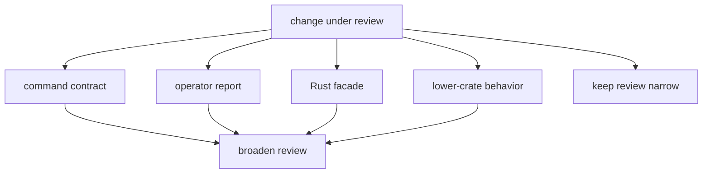

# Review Scope

Reviewers should scope a `bijux-gnss` change by command family first, then by
public promise. File count is a weak signal here: one flag rename can break
operators, while a larger internal helper edit can remain command-local.

## Narrow Review

- one command family with unchanged flags and output shape
- one report renderer where field meaning does not move
- one runtime support helper that still delegates science and persistence below
  the command crate
- one facade maintenance change whose owning lower crate is obvious

## Broad Review Triggers

- changes to command names, flags, or output shape
- changes that span several command families
- changes to `src/lib.rs`
- changes that require synchronized edits in `receiver`, `infra`, `nav`,
  `signal`, or `core`
- changed validation wording that users may rely on when diagnosing failures
- changed artifact routing, even when the persisted layout is owned by infra

## Why File Count Is Misleading

A one-line change to a stable command flag or validation publication path can
be riskier than a larger refactor isolated inside one support module.

## Review Exit Criteria

- The command promise is named in reader language, not only as a source file.
- Lower-crate behavior is linked back to the lower owner instead of described
  as if the command crate owns it.
- The package changelog records operator-visible or facade-visible changes.
- The chosen proof is narrow when possible and explicit when broad proof is
  needed.
