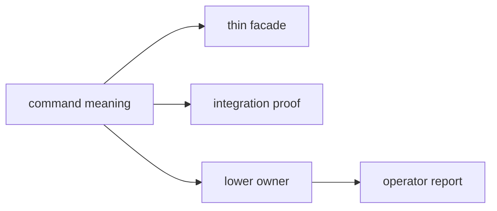

# Invariants

These are the expectations that should remain true even as `bijux-gnss` grows.

## Invariant Flow

## Boundary Invariants

- the command crate stays separate from lower-owner runtime, repository, and
  science internals
- public imports remain organized by command role through the binary and thin
  facade
- validation and reporting remain command-boundary presentation, not ownership
  transfer

## Public-Surface Invariants

- stable command names and flag meaning remain explicit
- workflow composition remains the command crate's owned responsibility
- the Rust facade remains thin and honest about lower ownership

## Breakage Signals

| signal | likely invariant at risk |
| --- | --- |
| command code computes receiver or nav behavior directly | boundary invariant |
| report wording changes without docs or proof | public command meaning |
| facade grows a broad re-export | ownership legibility |
| validation output changes silently | operator trust |

## Review Checks

- If public command meaning moves, do docs and proof obligations move with it?
- Can the operator route from command to artifact remain clear?
- Does the facade still reveal, rather than hide, lower ownership?
