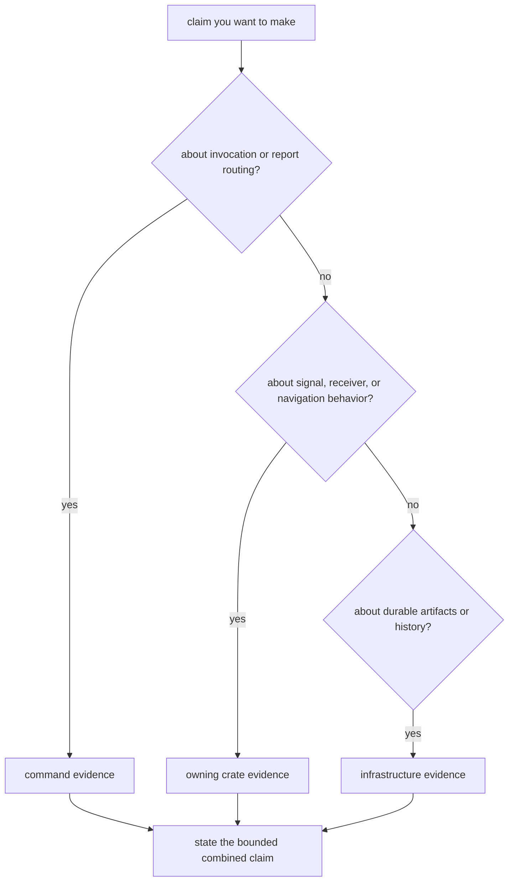

# Known Limitations

The CLI is an integration boundary, not an independent source of GNSS truth.
Its tests can prove that an operator route accepts inputs, calls the intended
owners, publishes evidence, and enforces command policy. They cannot turn a
bounded receiver or navigation result into a broader scientific guarantee.

## Interpret A Command Result

## Current Constraints

| constraint | what can go wrong | evidence required before a stronger claim |
| --- | --- | --- |
| Command tests cross several crates. | A broad pass does not identify whether parsing, receiver behavior, navigation science, or persistence was actually protected. | Name the command assertion and add the focused owner test for the behavior under discussion. |
| Report formats compress lower-layer evidence. | Counts and summaries can omit per-channel refusal, uncertainty, residual, or provenance details. | Follow the report to its typed artifact and confirm that the omitted evidence is available where the claim needs it. |
| Process errors are display-oriented. | Error text and context chains are not a versioned machine protocol, and stable numeric exit categories are not defined. | Automate against documented JSON artifacts and schemas; use process success only as one signal. |
| Output publication is not transactional. | A failure after an early write can leave plausible-looking partial output. | Require the expected manifest and validate the relevant artifacts before comparison or registration. |
| Synthetic workflows are model-bounded. | Deterministic success can be mistaken for coverage of front-end, propagation, interference, or oscillator conditions absent from the scenario. | Pair command wiring proof with receiver and signal evidence that names the modeled envelope. |
| Facade re-exports preserve convenience, not ownership. | A lower-layer type reachable from the top crate can be mistaken for a command-owned contract. | Read the [facade contract](../interfaces/facade-contracts.md) and review the original owner before changing meaning. |

## Claims The CLI Can Defend

The command suite is the right evidence for statements such as:

- the documented subcommand and arguments are accepted;
- invalid configuration is rejected before a workflow proceeds;
- the selected report format carries the documented command fields;
- a strict validation policy turns qualifying diagnostics into command failure;
- a command publishes the expected artifact route for a bounded fixture.

Start with the [command verification map](../operations/verification-commands.md).
It links each kind of claim to a focused test instead of asking readers to
search internal test directories.

## Claims That Need Another Owner

Do not cite a command test alone for these conclusions:

| claim | primary evidence owner |
| --- | --- |
| a spreading code, signal model, or DSP primitive is physically correct | [signal quality evidence](../../06-bijux-gnss-signal/quality/test-strategy.md) |
| acquisition, tracking, observations, or runtime handoff remain correct | [receiver validation guidance](../../05-bijux-gnss-receiver/quality/change-validation.md) |
| a model, correction, estimator, or integrity decision is scientifically justified | [navigation test strategy](../../04-bijux-gnss-nav/quality/test-strategy.md) |
| run output is complete, discoverable, and historically durable | [infrastructure test strategy](../../03-bijux-gnss-infra/quality/test-strategy.md) |

## Report Limitations Without Hiding Them

When command evidence is the best available proof but does not cover the full
claim, record the exact fixture, feature set, report format, and lower-layer
proof that was used. State the missing environment or owner-level evidence
plainly. A narrower claim with traceable evidence is more useful than a broad
claim inferred from one successful invocation.

The [command error model](../architecture/error-model.md) explains why an
unfavorable scientific report and a failed process are not interchangeable.
