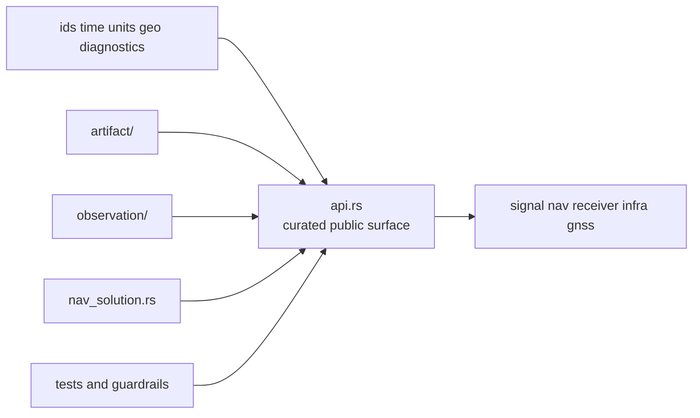

# Architecture

Open this section when the question is structural: where contract families live
in code, how dependency direction is enforced, and how the core crate keeps a
foundational shape instead of becoming a behavior-heavy library.

## Structural Shape

The architecture of `bijux-gnss-core` is not a runtime pipeline. It is a
contract lattice. `src/api.rs` curates what the outside world may rely on,
module families under `src/` own specific record domains, and guardrail tests
protect the rule that higher-level crates depend inward rather than the other
way around.

## Read These First

- open [Module Map](module-map.md) first when you need the fastest route from a
  contract question to the owning code area
- open [Dependency Direction](dependency-direction.md) when the concern is
  whether the crate is staying foundational
- open [State and Serialization](state-and-serialization.md) when the question
  is how record meaning survives persistence and validation

## First Proof Check

- `crates/bijux-gnss-core/src/api.rs`
- `crates/bijux-gnss-core/src/artifact/`
- `crates/bijux-gnss-core/src/observation/`
- `crates/bijux-gnss-core/docs/ARCHITECTURE.md`

## Pages In This Section

- [Module Map](module-map.md)
- [Dependency Direction](dependency-direction.md)
- [Code Navigation](code-navigation.md)
- [State and Serialization](state-and-serialization.md)
- [Integration Seams](integration-seams.md)
- [Error Model](error-model.md)
- [Extensibility Model](extensibility-model.md)
- [Architecture Risks](architecture-risks.md)

## Leave This Section When

- leave for [Foundation](../foundation/) when the real disagreement is still
  about ownership rather than structure
- leave for [Interfaces](../interfaces/) when the structural question is now a
  public contract question
- leave for [Quality](../quality/) when the structure is clear and the next
  question is whether the proofs are strong enough
