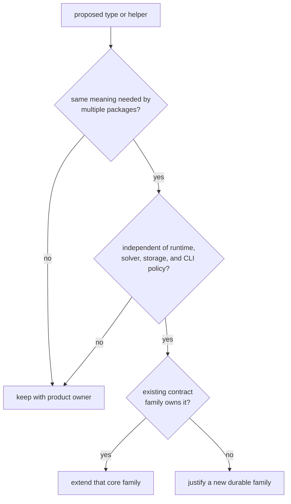

# Module Map

Use this map when deciding where shared GNSS meaning belongs. Start from the
contract a downstream package needs to exchange, not from a source filename or
the package that first requested it.

## Choose A Contract Family

| question | owning family | boundary |
| --- | --- | --- |
| How is a constellation, satellite, signal, or component identified? | [Identity contracts](../../../crates/bijux-gnss-core/src/ids.rs) | identity only; catalog and signal behavior stay in signal |
| Which time scale or physical quantity does a value use? | [Time contracts](../../../crates/bijux-gnss-core/src/time.rs) and [unit contracts](../../../crates/bijux-gnss-core/src/units.rs) | shared representation and conversion, not runtime clock policy |
| Which coordinate frame or shared sanity law applies? | [Geometry helpers](../../../crates/bijux-gnss-core/src/geo.rs) and [scientific conventions](../../../crates/bijux-gnss-core/src/conventions.rs) | reusable pure meaning, not estimator policy |
| What crosses acquisition, tracking, observation, or differencing boundaries? | [Observation contracts](../../../crates/bijux-gnss-core/src/observation/) | exchanged records, not stage implementation |
| How is measurement quality described across packages? | [Observation quality](../../../crates/bijux-gnss-core/src/observation_quality.rs) | evidence records, not receiver lock policy |
| What does a navigation result say independent of its solver? | [Navigation solution contracts](../../../crates/bijux-gnss-core/src/nav_solution.rs) | result, residual, lifecycle, and refusal records, not navigation algorithms |
| How is a record versioned and validated after serialization? | [Artifact contracts](../../../crates/bijux-gnss-core/src/artifact/) | envelope and payload meaning, not repository placement |
| How do packages exchange failures and diagnostics? | [Diagnostic contracts](../../../crates/bijux-gnss-core/src/diagnostic/) and [error taxonomy](../../../crates/bijux-gnss-core/src/error.rs) | structured shared meaning, not command wording |
| How is shared configuration or support declared? | [Configuration contracts](../../../crates/bijux-gnss-core/src/config.rs) and [support matrix](../../../crates/bijux-gnss-core/src/support_matrix.rs) | cross-package schema and inventory, not local defaults |

## Placement Decision

Do not create a new top-level family merely because a type feels "shared." A
new family needs distinct semantics, multiple real consumers, and a boundary
that will remain understandable after the requesting workflow changes.

## Public Boundary

The [curated core API](../../../crates/bijux-gnss-core/src/api.rs) is the only
downstream import route. The
[crate architecture guide](../../../crates/bijux-gnss-core/docs/ARCHITECTURE.md)
explains dependency and persistence boundaries, while the
[contract map](../../../crates/bijux-gnss-core/docs/CONTRACT_MAP.md) carries the
crate-local placement rules.

Use [State and Serialization](state-and-serialization.md) before changing a
persisted record and [Dependency Direction](dependency-direction.md) before
adding any package relationship.
