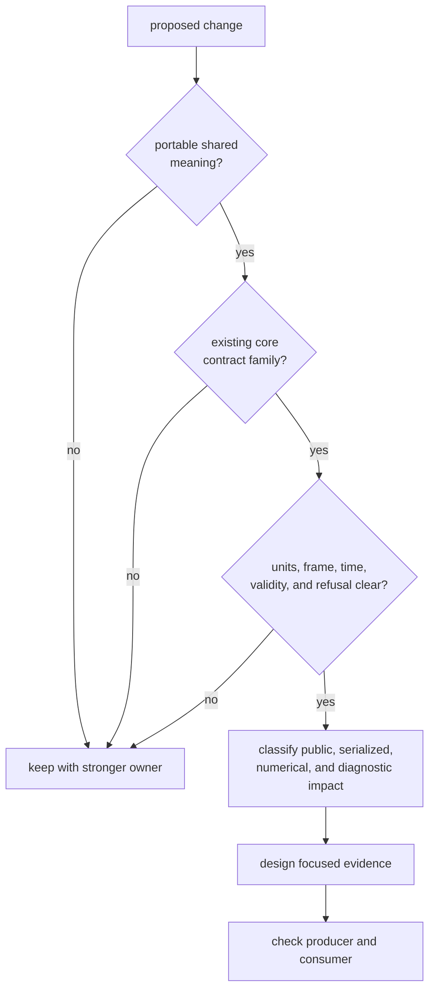
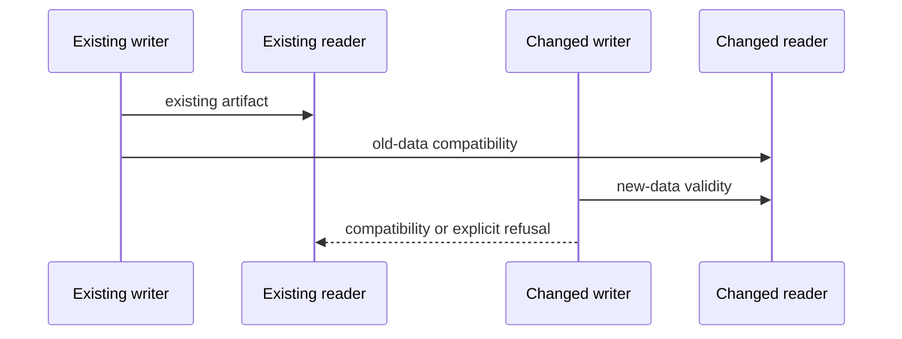

# Evolving Shared GNSS Contracts

A core change can alter Rust source compatibility, serialized data, numerical
meaning, validation behavior, diagnostics, and transitive APIs at the same
time. Classify those surfaces before editing the type. “Additive” is not a
compatibility verdict.

## Start With Ownership And Meaning

The [scope guide](scope-and-non-goals.md) defines portable shared meaning. If
the proposal needs one receiver session, navigation estimator, repository
layout, or command workflow to make sense, stop before creating a core type.

## Classify Every Compatibility Surface

| Surface | Questions to answer |
| --- | --- |
| public Rust API | Are names, construction, trait bounds, methods, variants, aliases, constants, or exhaustive matches affected? |
| serialized shape | Can existing readers parse new output, and can new readers interpret old output without unsafe defaults? |
| semantic meaning | Did units, frame, time system, ordering, sign, validity, uncertainty, or refusal change? |
| validation | Which state changes from accepted to diagnostic, degraded, or rejected? |
| diagnostics | Did a stable code’s condition, severity, context, or aggregation change? |
| numerical behavior | Did a formula, tolerance, conversion, finite-value rule, or boundary move? |
| consumers | Which direct users, transitive re-exports, artifact readers, and producers depend on the old contract? |

An unchanged struct definition can still carry a breaking semantic change. A
new enum variant can break exhaustive matches. A field with a serialization
default can parse old data while silently inventing meaning. Record each surface
independently.

## Prefer Compatible Evolution, Prove It

Useful patterns include:

- add a genuinely optional field only when absence has one safe meaning
- introduce a new diagnostic code instead of repurposing an existing code
- retain an old reader while a new artifact version is introduced
- add a new constructor while preserving validated construction paths
- tighten validation only when the newly rejected state is demonstrably
  invalid and consumers receive structured evidence

Compatibility claims require reader and consumer evidence. They are not
established by deriving serialization, retaining the same function name, or
passing the package guardrail.

## Treat Artifacts As A Reader-Writer Contract

The current [artifact policy](../../../crates/bijux-gnss-core/src/artifact.rs)
accepts schema version one only. A declared conversion helper for a later
version has no migration behavior because no later schema is defined.

Before changing serialized meaning:

1. state whether the existing schema retains exactly the same meaning
2. define which old records remain readable
3. define how old readers encounter new output
4. distinguish missing data from a safe default
5. validate cross-field coherence after deserialization
6. add independent fixtures that are actually loaded by tests
7. document any lossy conversion or explicit refusal

Do not assign new semantics to version one merely because the Rust type can
deserialize both shapes. The
[serialization contract](../../../crates/bijux-gnss-core/docs/SERIALIZATION.md)
records current evidence gaps.

## Keep The Public Surface Deliberate

Supported imports pass through the
[curated API](../../../crates/bijux-gnss-core/src/api.rs). The
[surface guardrail](../../../crates/bijux-gnss-core/tests/public_api_guardrail.rs)
uses source-text scanning to find public structs and free functions. It does
not detect all enums, traits, constants, aliases, methods, or semantic changes.

For a public change:

- update the owning contract family and invariant documentation
- add direct, downstream-shaped use of the item
- check construction and invalid-state control
- inspect exhaustive consumers for enum changes
- inspect transitive re-exports
- record compatibility impact in the
  [package history](../../../crates/bijux-gnss-core/CHANGELOG.md)

Do not expose an implementation helper because one consumer currently imports
equivalent logic.

## Match Evidence To The Change

| Change family | Minimum focused evidence |
| --- | --- |
| identity, status, or ordering | exact examples, invalid identities, boundary ordering, and consumer interpretation |
| units, coordinates, time, or conventions | reference values, generated properties, boundary cases, sign and frame assertions |
| observation or navigation records | one coherent record plus one-invariant-invalid variants |
| artifact payload | supported version, valid payload, malformed payload, semantic invalidity, and old-data behavior |
| diagnostic taxonomy | stable code, severity, context, summary aggregation, and first reporting consumer |
| public API | direct use plus the surface guardrail |

The [test evidence guide](../../../crates/bijux-gnss-core/docs/TESTS.md)
documents what current tests prove and where they are incomplete. A core suite
pass does not prove receiver accuracy, navigation convergence, persistence, or
command rendering.

## Review Downstream Impact

Use the [package placement guide](repository-fit.md) to inspect:

- direct consumers in signal, navigation, receiver, command workflows, and
  testkit
- indirect consumers through receiver and infrastructure re-exports
- persisted artifacts read by infrastructure or command workflows
- producers that construct the record and consumers that interpret it

Fix an incorrect downstream assumption rather than weakening a core invariant.
If only one owner requires specialized meaning, keep a specialized type there.

## Reject These Change Patterns

- adding a required serialized field without old-reader policy
- reusing a diagnostic code for a different condition
- changing a unit or frame without changing tests and documentation
- accepting non-finite or incoherent state to simplify one producer
- introducing a broad generic type before two consumers share semantics
- calling checked-in data a fixture when no test loads it
- citing the textual API guardrail as semantic compatibility proof
- leaving a placeholder conversion as the only migration plan

## State The Result

A reviewable core change names:

- the shared meaning and owning family
- every compatibility surface affected
- schema and reader behavior, when serialized
- focused evidence and downstream consumers checked
- known gaps that remain

The change is ready when old and new meaning are explicit, invalid states remain
observable, and consumers do not need undocumented reinterpretation.
