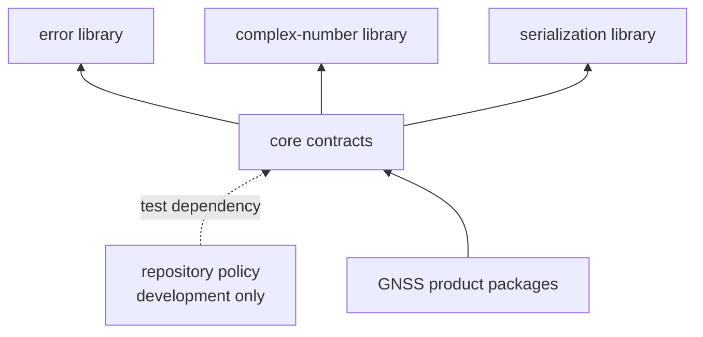
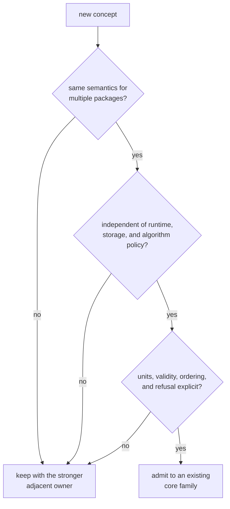

# Core Dependencies and Package Adjacencies

Core is shared vocabulary, not shared execution. Its production dependencies
support representation and serialization; higher GNSS packages consume its
contracts without becoming production dependencies of core.

## Current Dependency Boundary

The [package manifest](../../../crates/bijux-gnss-core/Cargo.toml) currently
uses three production libraries:

| Dependency purpose | Why core needs it | Boundary |
| --- | --- | --- |
| Error display | derive human-readable typed error wrappers | must not import command recovery or runtime retry policy |
| Complex numbers | represent reusable numerical quantities | must not pull signal processing orchestration into core |
| Serialization | encode shared records and artifact envelopes | must not decide repository layout or file naming |

Property testing and repository-policy checks are development dependencies.
The policy package can inspect core during tests without becoming part of
core’s published production graph.

## Adjacency Is Not Ownership

An adjacent package exchanges records with core but retains its own decisions.

| Adjacent package | Shared core meaning | Meaning that stays outside core |
| --- | --- | --- |
| Signal | identities, units, observations, diagnostics | code generation, modulation, sampling, and DSP behavior |
| Navigation | observations, solution records, residuals, validity, refusal | estimators, corrections, integrity methods, PPP, and RTK science |
| Receiver | acquisition, tracking, observation, diagnostic, and artifact records | stage orchestration, lock lifecycle, channels, ports, and runtime policy |
| Infrastructure | artifact envelopes, kinds, payload validation, and provenance fields | paths, manifests, history, datasets, persistence, and discovery |
| Command facade | shared configuration, support, diagnostics, and report values | parsing, workflow selection, rendering, exit policy, and operator advice |

Core may define the record at a seam without implementing either producer or
consumer behavior.

## Decide Where a New Concept Belongs

Duplication alone does not justify core ownership. Two adapters can be safer
than one supposedly shared helper that embeds both callers’ assumptions.

## Review a New Production Dependency

Require all of the following:

1. The capability supports a core-owned contract family rather than a
   downstream workflow.
2. The dependency does not import another GNSS product package.
3. The public contract remains understandable without the dependency’s private
   types or runtime.
4. Feature and platform effects are explicit for every published consumer.
5. License, minimum Rust version, serialization, determinism, and numerical
   implications are reviewed.
6. The dependency removes more long-term ambiguity than it introduces.

Keep optionality narrow. A feature flag that exists only to teach core about a
higher package is a reversed boundary, not a valid extension.

## Detect Boundary Drift

Stop when:

- a core function needs receiver state, navigation workspace, repository path,
  or command context
- an error message embeds one operator workflow’s recovery instructions
- a validator invokes an adjacent package’s algorithm
- a shared record uses a downstream private type
- a development helper is promoted to production to avoid test duplication
- dependency direction is justified only as “convenient”

Use the [dependency architecture](../architecture/dependency-direction.md) for
edge rules, the [ownership boundary](ownership-boundary.md) for contract
admission, and the
[crate boundary](../../../crates/bijux-gnss-core/docs/BOUNDARY.md) for the
published production scope.

The dependency posture is healthy when core remains portable common language,
development tooling stays outside published artifacts, and adjacent packages
exchange explicit records without donating their behavior to core.
