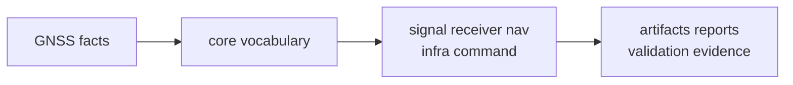

# Domain Language

The core crate succeeds when downstream packages can speak one GNSS language
without re-explaining basics to each other.

## Vocabulary Flow

## Vocabulary Families

| family | words mean | reader risk when duplicated |
| --- | --- | --- |
| identity | constellation, satellite, signal, band, code, component, and support status | PRN, slot, or signal claims stop comparing cleanly |
| time | GPS time, UTC, TAI, leap seconds, sample clocks, and epoch framing | observations and artifacts disagree about when evidence occurred |
| units | meters, seconds, cycles, hertz, chips, and conversion helpers | code silently mixes dimensions |
| geometry | ECEF, ENU, LLH, and geodetic conversions | positions become frame-dependent guesses |
| measurements | acquisition, tracking, observations, differencing, quality, and navigation solution records | receiver and nav exchange loses a stable seam |
| artifacts | versioned envelopes, payload kinds, validation reports, and diagnostics | persisted evidence becomes hard to inspect later |

## Naming Pressure

If a downstream crate invents a near-synonym for an existing core record, the
reader loses more than naming clarity. They lose the ability to trust
cross-crate comparisons, validation output, and persisted artifacts.

## Review Questions

- Is this term foundational, or does it belong to receiver, nav, signal, infra,
  or command behavior?
- Does an existing core type already carry the same meaning?
- Would a persisted artifact still be understandable if this type changed?
- Are units, time systems, and coordinate frames explicit at the boundary?
- Can downstream crates compare records without translating local synonyms?

## First Proof Check

Start with the [identifier vocabulary](../../../crates/bijux-gnss-core/src/ids.rs),
[time model](../../../crates/bijux-gnss-core/src/time.rs),
[unit types](../../../crates/bijux-gnss-core/src/units.rs), and
[geodesy helpers](../../../crates/bijux-gnss-core/src/geo.rs). Then verify
cross-crate records through the [observation model](../../../crates/bijux-gnss-core/src/observation/),
[navigation solution model](../../../crates/bijux-gnss-core/src/nav_solution.rs), and
[contract map](../../../crates/bijux-gnss-core/docs/CONTRACT_MAP.md).
