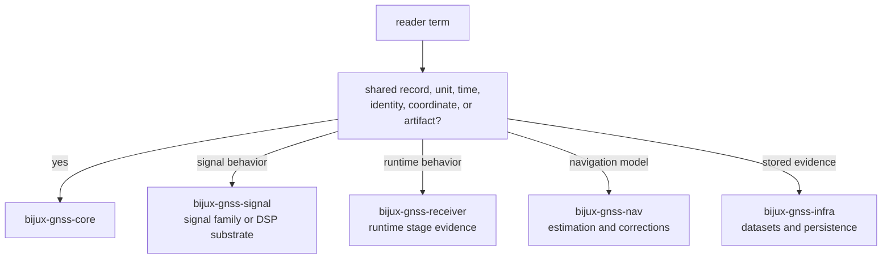

# Glossary Routes

Use this page when a reader knows the GNSS word but not the owning crate. Core
owns shared vocabulary only when the term describes a record, identity, unit,
time, coordinate, diagnostic, or artifact shape that multiple crates must read
the same way.

## Route From Term To Owner

## Core-Owned Terms

| term family | core owner | when to leave core |
| --- | --- | --- |
| constellation, satellite, PRN, signal identity | `src/ids.rs` | signal generation details live in signal |
| GPS, UTC, TAI, sample time, leap seconds | `src/time.rs` | receiver clock policy lives in receiver |
| meters, seconds, hertz, chips, cycles | `src/units.rs` and `src/conventions.rs` | DSP implementation details live in signal or receiver |
| WGS-84, ECEF, ENU, geodetic position | `src/geo.rs` | estimator strategy lives in nav |
| acquisition, tracking, observation record shapes | `src/observation/` | stage scheduling and runtime transitions live in receiver |
| navigation solution records and residual records | `src/nav_solution.rs` | solver algorithms and correction models live in nav |
| diagnostics and support matrix records | `src/diagnostic/`, `src/support_matrix.rs` | command reporting and infra persistence live above core |

## Reader Checks

- Is the reader asking what a value means across crates? Start in core.
- Is the reader asking how a signal is generated or sampled? Leave for signal.
- Is the reader asking why a runtime stage accepted, degraded, or rejected data?
  Leave for receiver.
- Is the reader asking how a solver, correction, PPP, or RTK model behaves?
  Leave for nav.
- Is the reader asking where evidence is stored or indexed? Leave for infra.

## First Proof Check

Inspect `crates/bijux-gnss-core/docs/CONTRACT_MAP.md`,
`crates/bijux-gnss-core/docs/CONTRACTS.md`,
`crates/bijux-gnss-core/docs/PUBLIC_API.md`, and the owning module named by the
term family.
