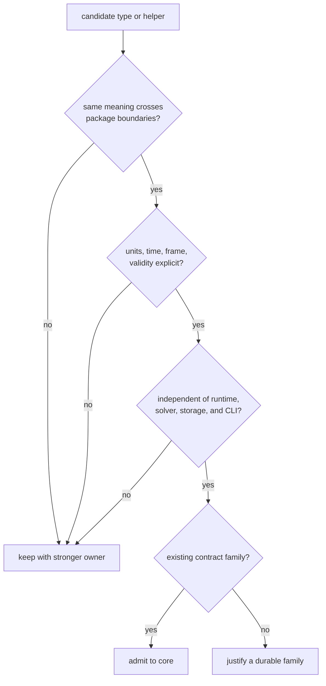
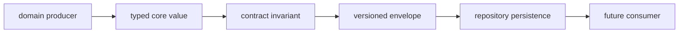

# Shared Contract Foundations

`bijux-gnss-core` gives independent packages one meaning for identities, units,
time, coordinates, observations, navigation outcomes, diagnostics, and
versioned records. It is not a general utility crate. A contract belongs here
only when producers and consumers need the same semantics without importing
receiver, signal, navigation, repository, or command policy.

## Decide From Meaning, Not Reuse

Code reuse is not enough. Two packages may perform similar calculations while
requiring different assumptions, failure behavior, or lifecycle state. Sharing
such a helper through core would hide the disagreement rather than resolve it.

## Questions Core Must Answer

| question | contract route |
| --- | --- |
| How is a satellite, signal, component, or channel identified? | [Shared concepts](shared-concepts.md) and [domain language](domain-language.md) |
| Which units, clock, time scale, or coordinate frame apply? | [Shared concepts](shared-concepts.md) |
| What record crosses acquisition, tracking, observation, or navigation boundaries? | [Contract interfaces](../interfaces/) |
| What makes a persisted record readable and valid? | [Artifact contracts](../interfaces/artifact-contracts.md) |
| Is a proposed type genuinely shared or merely convenient? | [Ownership boundary](ownership-boundary.md) |
| Can the contract remain portable outside this workspace? | [Portability decision](portability-decision.md) |
| What compatibility burden follows a change? | [Core quality model](../quality/) |

## The Semantic Checklist

Before admitting or changing a shared contract, state:

- the identity of every producer and consumer;
- physical units, time systems, coordinate frames, and sign conventions;
- valid, degraded, refused, missing, and unknown states;
- whether ordering and equality have scientific meaning;
- serialization version and reader policy when bytes persist;
- the validator or invariant evidence that rejects contradictory state.

If one of these answers depends on a receiver loop, navigation solver,
filesystem layout, or command option, that part belongs with the stronger
owner.

## From Value To Evidence

Core owns the typed value, its invariant, and the meaning of its versioned
envelope. Infrastructure owns where bytes are stored and how runs are found.
The producing scientific crate remains responsible for why the value was
created.

## Continue By Decision

Use the [package overview](package-overview.md) for the concise package role,
[scope and non-goals](scope-and-non-goals.md) for explicit refusals, and
[repository fit](repository-fit.md) for dependency context. The
[architecture guide](../architecture/) explains how private families reach the
curated API. [Glossary routes](glossary-routes.md) point to canonical terms,
while [change principles](change-principles.md) set the compatibility standard.

For implementation evidence, inspect the
[curated API](../../../crates/bijux-gnss-core/src/api.rs),
[contract map](../../../crates/bijux-gnss-core/docs/CONTRACT_MAP.md),
[invariant guide](../../../crates/bijux-gnss-core/docs/INVARIANTS.md), and
[serialization guide](../../../crates/bijux-gnss-core/docs/SERIALIZATION.md).
