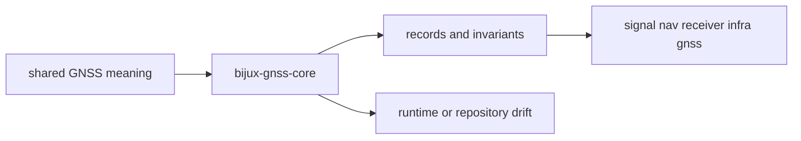

# Foundation

Open this section when the question is why `bijux-gnss-core` exists before any
other GNSS crate begins doing work. These pages should settle whether a type,
record, or helper really belongs in the shared contract layer or whether a
downstream crate is trying to outsource its own local ownership.

## Boundary Model

The core boundary is only credible if a reader can tell where shared meaning
stops and where crate-local execution or persistence begins.

## Read These First

- open [Ownership Boundary](ownership-boundary.md) first when a proposed type
  or helper might belong in `signal`, `nav`, `receiver`, or `infra` instead
- open [Package Overview](package-overview.md) when you need the shortest
  durable description of the crate’s role
- open [Scope and Non-Goals](scope-and-non-goals.md) when the question is what
  the core layer should explicitly refuse

## The Mistake This Section Prevents

The main mistake here is turning `bijux-gnss-core` into a convenient dumping
ground for anything that feels "shared enough" today but is really runtime
logic, persistence mechanics, or scientific behavior with a stronger owner.

## Pages In This Section

- [Package Overview](package-overview.md)
- [Scope and Non-Goals](scope-and-non-goals.md)
- [Ownership Boundary](ownership-boundary.md)
- [Shared Concepts](shared-concepts.md)
- [Glossary Routes](glossary-routes.md)
- [Portability Decision](portability-decision.md)
- [Repository Fit](repository-fit.md)
- [Domain Language](domain-language.md)
- [Dependencies and Adjacencies](dependencies-and-adjacencies.md)
- [Change Principles](change-principles.md)

## First Proof Check

- `crates/bijux-gnss-core/src/api.rs`
- `crates/bijux-gnss-core/src/artifact/`
- `crates/bijux-gnss-core/src/observation/`
- `crates/bijux-gnss-core/src/time.rs`
- `crates/bijux-gnss-core/src/units.rs`
- `crates/bijux-gnss-core/docs/CONTRACT_MAP.md`

## Leave This Section When

- leave for [Interfaces](../interfaces/) when the dispute is already about
  serialized shapes, public imports, or caller-visible entrypoints
- leave for [Architecture](../architecture/) when the ownership question is
  settled and the next question is where the code lives
- leave for [Quality](../quality/) when the boundary is clear and the real
  question is whether the proofs and invariants are strong enough
