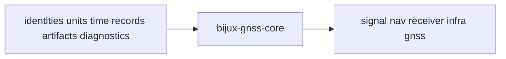

# Package Overview

`bijux-gnss-core` exists to make GNSS meaning durable before downstream crates
add signal processing, navigation inference, runtime orchestration, or
repository persistence.

The crate is foundational because it is restrictive, not because it is broad.
It should collect only the record families that more than one downstream owner
must share without reinterpretation.

## Role Model

If a downstream crate needs to exchange a GNSS record with another crate or
persist one inside a stable artifact envelope, this package is usually where
that meaning should already be defined.

The durable centers of gravity are:

- `src/ids.rs`, `src/time.rs`, `src/units.rs`, and `src/geo.rs` for canonical
  identity, time, and physical meaning
- `src/observation/`, `src/observation_quality.rs`, and
  `src/nav_solution.rs` for exchanged runtime records
- `src/artifact.rs`, `src/artifact/`, and `src/config.rs` for versioned
  artifact and validation-report contracts
- `src/diagnostic/`, `src/error.rs`, and `src/support_matrix.rs` for shared
  failure, reporting, and support inventory semantics

## Boundary Verdict

If the work improves shared identifiers, units, time conversions, observation
records, navigation-solution records, diagnostics, or artifact envelopes
without binding them to one runtime or persistence model, it belongs here. If
the work starts carrying DSP implementation, repository layout, solver policy,
or command behavior, it has crossed the boundary.

## What This Package Makes Possible

- higher-level crates can exchange one observation or artifact language instead
  of inventing near-duplicates
- receiver and navigation code can disagree about algorithms without
  disagreeing about record meaning
- persisted artifacts can be validated against one contract owner rather than
  against whichever crate happened to write them first

## Tempting Mistakes

- putting runtime-specific helpers into core because more than one stage calls
  them today
- moving repository persistence logic into artifact envelopes because both feel
  "storage related"
- broadening the public API with local implementation helpers that are not
  actually cross-crate contracts

## First Proof Check

- `crates/bijux-gnss-core/src/api.rs`
- `crates/bijux-gnss-core/src/config.rs`
- `crates/bijux-gnss-core/src/diagnostic/codes.rs`
- `crates/bijux-gnss-core/src/artifact/`
- `crates/bijux-gnss-core/src/observation/`
- `crates/bijux-gnss-core/src/nav_solution.rs`

## Design Pressure

The package stays coherent only when it remains slightly stricter than
contributors first want. Anything ambiguous should default toward a stronger
downstream owner unless the cross-crate contract need is obvious.
