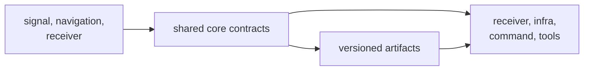

# Package Overview

`bijux-gnss-core` is the shared language of the GNSS workspace. It defines
identities, units, time, observations, navigation results, diagnostics, support
records, and artifact envelopes before higher packages add algorithms,
execution, persistence, or operator policy.

Core is useful because it is restrictive. A contract belongs here only when
multiple packages need the same meaning and that meaning survives independently
of any one workflow.

## Where Core Sits

The arrows describe exchange, not ownership transfer. Receiver may produce a
tracking epoch and navigation may produce a solution epoch, but core owns the
shared record semantics that let other packages consume those results.

## Use Core When

| need | core is the right owner when |
| --- | --- |
| identity or unit | every caller must agree on the same constellation, signal, time scale, coordinate frame, or physical quantity |
| pipeline record | a result crosses package boundaries without carrying one stage's implementation state |
| diagnostic | code, severity, fields, and aggregation need stable machine-readable meaning |
| artifact payload | serialized records need explicit version and validation behavior |
| support declaration | runtime, infra, and commands need one inventory vocabulary |
| pure helper | the operation defines shared scientific meaning and requires no runtime, filesystem, or solver policy |

## Keep The Concern Elsewhere

- Signal catalogs, code generation, sample conversion, and DSP belong in
  signal.
- Orbit products, physical corrections, estimators, PPP, and RTK belong in
  navigation.
- Stage orchestration, channel lifecycle, ports, and runtime diagnostics belong
  in receiver.
- Dataset discovery, run layout, manifests, and artifact inspection belong in
  infra.
- Commands, flags, workflow selection, and report wording belong in the command
  package.

A concern does not become core merely because two functions use it. The
semantics must be shared, durable, and independent of both callers.

## What Downstream Readers Can Rely On

- Public contracts are imported through `bijux_gnss_core::api`.
- Implementation modules remain private.
- Units, time, coordinates, validity, and refusal state should be explicit in
  exchanged records.
- Versioned artifact meaning is owned here; repository placement is not.
- Shared diagnostics remain structured rather than being reduced to display
  text.

## Continue Reading

Use [Scope and Non-Goals](scope-and-non-goals.md) for ownership disputes,
[Shared Concepts](shared-concepts.md) for the common vocabulary, and
[Ownership Boundary](ownership-boundary.md) before admitting a new contract.
For implementation structure, continue to the
[Module Map](../architecture/module-map.md). For public or serialized changes,
open [Public Imports](../interfaces/public-imports.md) and
[State and Serialization](../architecture/state-and-serialization.md).
