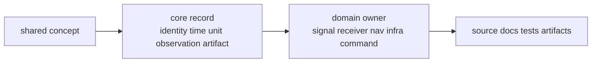

# Shared Concepts

Core concepts are the words and record meanings that higher crates exchange
without reinterpretation. Core does not execute receiver stages, generate signal
replicas, solve PPP, persist run directories, or render operator reports. It
defines the shared language those owners use.

## Concept Route

## Concept Families

| concept | core-owned meaning | implementation owner |
| --- | --- | --- |
| acquisition | request, result, evidence, and explainability records | receiver acquisition stage |
| tracking | tracking epoch, transition, lifecycle, and state records | receiver tracking stage |
| observations | per-epoch measurements, quality, rejection, and differencing records | receiver observation construction and nav consumption |
| navigation solution | solver output, residual, validity, lifecycle, and refusal records | nav estimation algorithms |
| artifact | versioned payload envelopes and validation traits | infra persistence and command export |
| diagnostics | shared severity, code, event, and summary shape | receiver and command runtime reporting |
| identity, time, units, coordinates | reusable GNSS facts and wrappers | every higher crate consumes them |

## Reader Decisions

- Start in core when the question is what a shared field means.
- Leave for receiver when the question is how a stage produced the field.
- Leave for nav when the question is how science or estimation computed the
  value.
- Leave for infra when the question is where the value is stored or replayed.
- Leave for command docs when the question is how the value is shown to users.

## First Proof Check

Inspect `crates/bijux-gnss-core/docs/CONTRACT_MAP.md`,
`crates/bijux-gnss-core/docs/CONTRACTS.md`,
`crates/bijux-gnss-core/src/observation/`,
`crates/bijux-gnss-core/src/nav_solution.rs`,
`crates/bijux-gnss-core/src/artifact/`, and
`crates/bijux-gnss-core/src/diagnostic/`.
