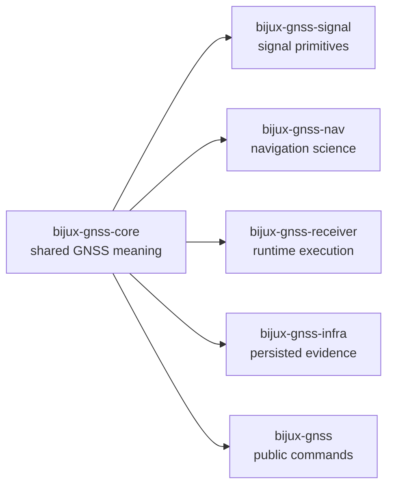

# bijux-gnss-core

`bijux-gnss-core` owns the shared scientific and operational contracts that the
rest of `bijux-telecom` depends on. This is where identifiers, units, time
systems, observation records, diagnostics, and artifact envelopes become
durable enough for higher-level crates to build on without reinterpreting the
same meaning in seven places.

If another crate is the action layer, `bijux-gnss-core` is the meaning layer.
It should be boring in the best possible way: precise, typed, reusable, and
hard to misread.

## Read These First

- open [Foundation](foundation/) when the question is why the crate exists,
  what it owns, and where it should refuse more work
- open [Interfaces](interfaces/) when the dispute is already about public
  imports, artifact envelopes, observation records, or configuration-facing
  contracts
- open [Architecture](architecture/) when the question is structural: which
  module owns which contract family and how the crate stays dependency-light
- open [Quality](quality/) when the boundary is clear and the question becomes
  whether the proofs are strong enough

## Why This Package Exists

- cross-package GNSS meaning must be defined once before signal, navigation,
  receiver, and infrastructure crates build on it
- versioned artifacts and observation records need one canonical contract owner
- shared diagnostics, IDs, time conversions, and units should not drift by
  crate

## What It Owns

- canonical identifiers for constellations, satellites, signals, and
  supporting matrices
- units, geometry, and time-system conversion contracts
- acquisition, tracking, observation, differencing, and navigation-solution
  records
- shared diagnostics, config validation helpers, and crate-foundational error
  categories
- versioned artifact envelopes and payload validation rules

## What It Refuses

- raw-IQ ingestion and sample-source behavior owned by `bijux-gnss-signal`
- dataset registry, run layout, or experiment persistence owned by
  `bijux-gnss-infra`
- navigation estimation strategies owned by `bijux-gnss-nav`
- receiver scheduling, stage orchestration, and runtime policy owned by
  `bijux-gnss-receiver`
- operator-facing commands owned by `bijux-gnss`

## Strongest Proof Surfaces

- crate README:
  [`crates/bijux-gnss-core/README.md`](../../crates/bijux-gnss-core/README.md)
- public contract docs:
  [`crates/bijux-gnss-core/docs/PUBLIC_API.md`](../../crates/bijux-gnss-core/docs/PUBLIC_API.md),
  [`crates/bijux-gnss-core/docs/CONTRACTS.md`](../../crates/bijux-gnss-core/docs/CONTRACTS.md)
- invariant and serialization docs:
  [`crates/bijux-gnss-core/docs/INVARIANTS.md`](../../crates/bijux-gnss-core/docs/INVARIANTS.md),
  [`crates/bijux-gnss-core/docs/SERIALIZATION.md`](../../crates/bijux-gnss-core/docs/SERIALIZATION.md)
- source roots:
  [`crates/bijux-gnss-core/src/api.rs`](../../crates/bijux-gnss-core/src/api.rs),
  [`crates/bijux-gnss-core/src/artifact`](../../crates/bijux-gnss-core/src/artifact),
  [`crates/bijux-gnss-core/src/observation`](../../crates/bijux-gnss-core/src/observation)
- proof tests:
  [`crates/bijux-gnss-core/tests`](../../crates/bijux-gnss-core/tests)

## Sections In This Handbook

- [Foundation](foundation/) for role, scope, ownership, repository fit, and
  contract-language discipline
- [Architecture](architecture/) for module layout, dependency direction,
  extensibility, and code navigation
- [Interfaces](interfaces/) for public imports, artifact envelopes,
  observation contracts, navigation-solution records, and examples
- [Operations](operations/) for safe change sequence, local verification, and
  maintenance workflows around the crate
- [Quality](quality/) for invariants, trust boundaries, validation commands,
  and known risks
- [This Package Does Not Own](this-package-does-not-own.md) for the shortest
  explicit refusal ledger

## Start Here When

- the question is about the shape or semantics of data shared across crates
- the reader needs to know where IDs, units, times, or artifact records become
  canonical
- a higher-level crate seems to be inventing meaning it should have inherited
- the issue is whether an artifact or observation record is valid independent
  of runtime or CLI policy

## Reader Questions This Package Can Answer

- what a tracked observation, navigation solution, or artifact envelope means
- which time and coordinate conventions are repository law rather than local
  convenience
- where diagnostic codes and shared support matrices become canonical
- whether a change belongs in a downstream crate or in the cross-package
  contract layer first

## Leave This Handbook When

- the question becomes about persisted dataset or run layout behavior:
  [03-bijux-gnss-infra](../03-bijux-gnss-infra/)
- the question becomes about signal codes, raw-IQ contracts, or DSP:
  [06-bijux-gnss-signal](../06-bijux-gnss-signal/)
- the question becomes about navigation estimation or orbit products:
  [04-bijux-gnss-nav](../04-bijux-gnss-nav/)
- the question becomes about runtime composition or stage execution:
  [05-bijux-gnss-receiver](../05-bijux-gnss-receiver/)

## First Proof Check

- `crates/bijux-gnss-core/src/api.rs`
- `crates/bijux-gnss-core/src/ids.rs`
- `crates/bijux-gnss-core/src/time.rs`
- `crates/bijux-gnss-core/src/units.rs`
- `crates/bijux-gnss-core/src/observation/`
- `crates/bijux-gnss-core/src/artifact/`
- `crates/bijux-gnss-core/docs/CONTRACT_MAP.md`

## Design Pressure

If `bijux-gnss-core` starts carrying runtime policy, repository persistence, or
crate-local convenience helpers that one downstream owner could define for
itself, the shared contract layer becomes weaker rather than stronger.
