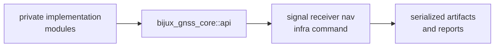

# API Surface

`bijux-gnss-core` exports one deliberate downstream surface:
`bijux_gnss_core::api`. That surface is the stable vocabulary shared by signal,
receiver, navigation, infra, and command crates.

## API Boundary Flow

## Public Families

| family | exported meaning | caller use |
| --- | --- | --- |
| artifacts | versioned envelopes, payload kinds, headers, read policy, and validation traits | persist or validate shared evidence |
| configuration | schema versions, configuration records, and validation reports | exchange validated setup meaning |
| diagnostics and errors | diagnostic codes, severity, summaries, and canonical error enums | report failures without inventing parallel taxonomies |
| identity | constellations, satellites, signals, bands, codes, and registry records | identify GNSS facts consistently |
| time and units | GPS, UTC, TAI, sample clocks, strong physical units, and conversions | preserve measurement units and epoch meaning |
| geometry | ECEF, ENU, LLH, and geodetic conversion helpers | exchange coordinate facts |
| observations and tracking | acquisition, sample, tracking, observation, differencing, and quality records | pass receiver evidence across crate boundaries |
| navigation records | solution status, residuals, assumptions, lifecycle state, and support matrices | share solver-neutral navigation output |

## Admission Rules

- Re-export a symbol through `api.rs` only when it has cross-crate meaning.
- Keep implementation helpers private when a type exists for one module only.
- Update contract, invariant, and serialization docs when public meaning
  changes.
- Prefer extending an existing family over creating a new namespace that makes
  readers guess ownership.
- Treat public records as compatibility commitments once downstream crates or
  persisted artifacts depend on them.

## First Proof Check

Inspect `crates/bijux-gnss-core/src/api.rs`,
`crates/bijux-gnss-core/docs/PUBLIC_API.md`,
`crates/bijux-gnss-core/docs/CONTRACTS.md`,
`crates/bijux-gnss-core/docs/INVARIANTS.md`,
`crates/bijux-gnss-core/docs/CONTRACT_MAP.md`, and
`crates/bijux-gnss-core/tests/public_api_guardrail.rs`.
