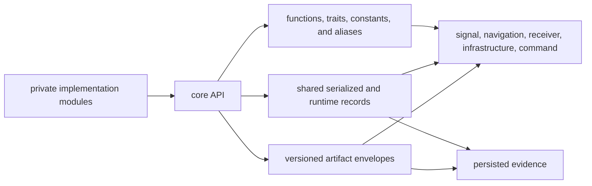
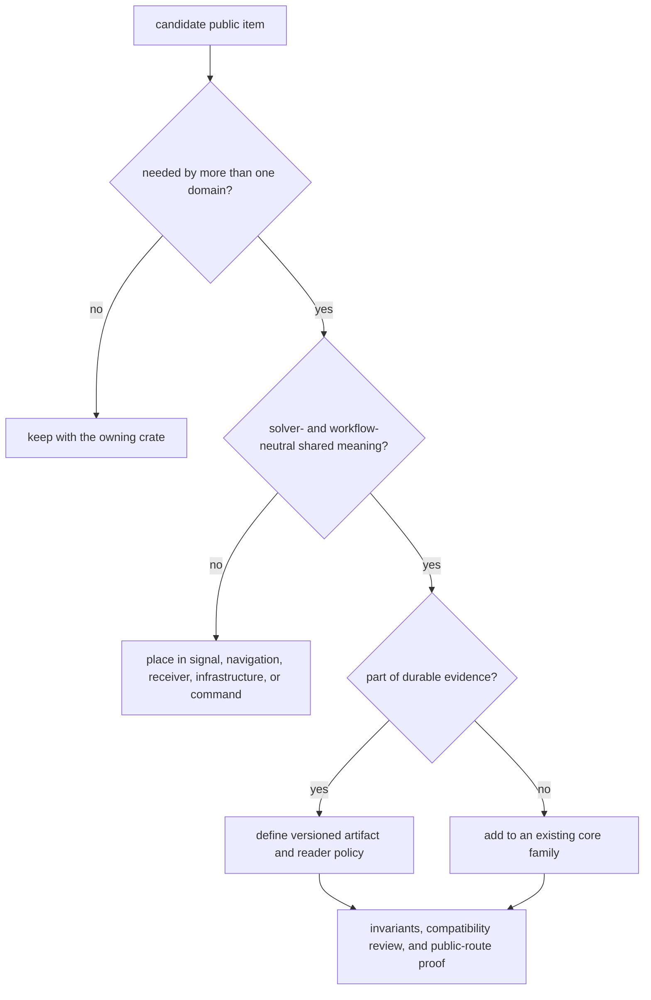

# API Surface

`bijux_gnss_core::api` is the workspace’s shared contract surface. It contains
more than Rust conveniences: some exports are versioned persisted envelopes,
some are serializable records embedded in those envelopes, and others are
runtime helpers, constants, or aliases. Their compatibility obligations differ.

## Contract Classes

| class | examples | compatibility review |
| --- | --- | --- |
| versioned artifact | headers, artifact kinds, read policy, validators, and versioned acquisition, tracking, observation, navigation, and support payloads | schema version, reader policy, validation, conversion, and persisted fixtures |
| shared record | identity, time, units, acquisition, tracking, observation, solution, diagnostics, and support records | field meaning, serde representation, defaults, enum variants, units, and every direct consumer |
| runtime helper | geodetic conversion, time conversion, sanity checks, sorting, statistics, and stability keys | numerical convention, error behavior, determinism, and caller assumptions |
| constant or model marker | carrier frequencies, model versions, stability signatures, and string identifiers | downstream comparisons, artifact interpretation, and coordinated version changes |
| alias or trait | navigation epoch alias, artifact payload aliases, validation traits | type identity, implementor expectations, and whether the alias hides ownership |

Serialization support alone does not make a record a versioned artifact.
Persist durable evidence through the artifact family and its validation policy,
not by serializing any public record ad hoc.

## Public Families

The [authoritative export surface](../../../crates/bijux-gnss-core/src/api.rs)
groups shared vocabulary into these responsibilities:

- artifact envelopes and payload validation;
- configuration composition and validation reports;
- diagnostics and canonical cross-boundary error categories;
- constellation, satellite, signal, band, component, and frequency identity;
- GPS, UTC, TAI, receiver-sample time, leap seconds, and strong units;
- WGS-84 geometry and coordinate transforms;
- acquisition, tracking, observation, differencing, uncertainty, and quality
  records;
- solver-neutral navigation status, residual, lifecycle, refusal, and support
  records.

The [contract map](../../../crates/bijux-gnss-core/docs/CONTRACT_MAP.md) identifies
the implementation owner behind each family. The
[contract guide](../../../crates/bijux-gnss-core/docs/CONTRACTS.md) explains
which meanings higher crates exchange.

## Admit A New Export

Before admitting an item:

1. Name at least two independent domain consumers or one durable artifact
   contract that requires it.
2. Confirm the item does not embed receiver scheduling, navigation algorithm
   state, repository layout, or command presentation.
3. Place it in an existing contract family unless a genuinely new shared
   responsibility exists.
4. Define units, time system, coordinate frame, defaults, invalid states, and
   equality or ordering expectations where relevant.
5. Review serialization and model-version consequences.
6. Add focused invariant and public-route evidence.

Use the [ownership boundary](../foundation/ownership-boundary.md) when a proposed
type is shared only because one higher-level implementation is convenient.

## What The Guardrail Enforces

The [public API guardrail](../../../crates/bijux-gnss-core/tests/public_api_guardrail.rs)
checks that free public structs and free public functions found in implementation
modules are named in the API surface. It does not comprehensively enforce:

- public enums, traits, aliases, constants, or methods;
- whether a re-export is semantically appropriate for core;
- serde field and variant compatibility;
- numerical or unit invariants;
- downstream source compatibility.

Treat the guardrail as an omission detector, not an API review. The
[invariant guide](../../../crates/bijux-gnss-core/docs/INVARIANTS.md) and
[serialization guide](../../../crates/bijux-gnss-core/docs/SERIALIZATION.md)
carry the broader review obligations.

## Change Review

For an existing export, identify its contract class first. Then inspect direct
consumers and persisted forms, add negative evidence for invalid states, and
change model or schema versions when old and new meaning cannot be safely read
as equivalent.

Do not preserve a misleading field or alias merely to avoid a breaking change.
Use an explicit versioned contract and migration path when durable evidence is
already affected.
