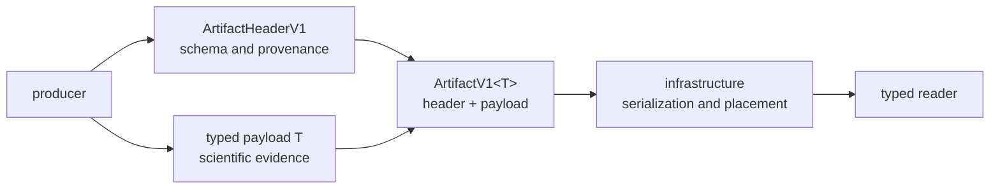
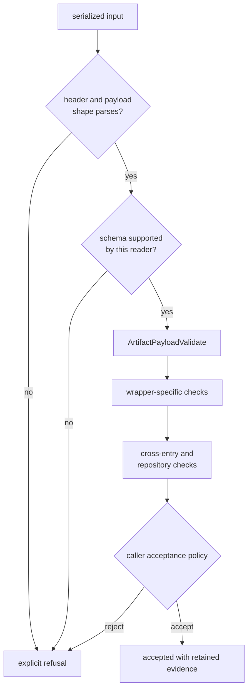
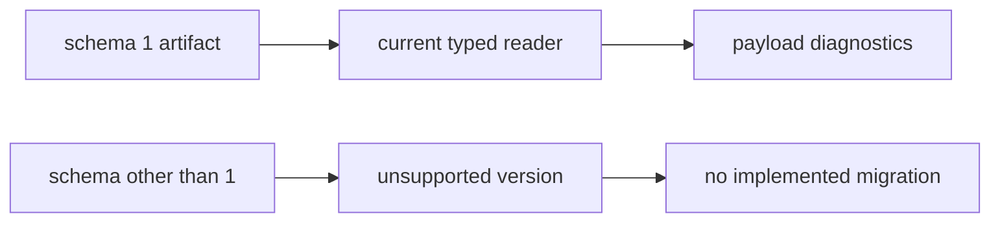

# Artifact Contracts

Core artifacts are portable scientific records. They bind producer context to
a typed payload so receiver, navigation, infrastructure, automation, and later
readers can exchange evidence without importing one runtime’s private state.
Core owns the envelope and payload meaning. It does not own filenames, run
directories, file discovery, or command rendering.

## Wire Shape

Every version-one artifact is an `ArtifactV1<T>` with exactly two top-level
members:

```json
{
  "header": {
    "schema_version": 1,
    "producer": "bijux-gnss-infra",
    "producer_version": "0.1.0",
    "created_at_unix_ms": 0,
    "git_sha": "...",
    "config_hash": "...",
    "dataset_id": null,
    "toolchain": "...",
    "features": [],
    "deterministic": true,
    "git_dirty": false
  },
  "payload": {}
}
```

`T` supplies the family-specific payload. The generic wrapper does **not**
contain an artifact-kind field. `ArtifactKind` is a separate classification
enum used by callers; readers that need kind without external context must
obtain it from a file contract, an explicit label, or the expected payload type.



## Header Meaning

| Field | Reader meaning | Deserialization behavior |
| --- | --- | --- |
| `schema_version` | schema expected for the wrapped payload | required |
| `producer` | crate or component that created the record | defaults to `unknown` |
| `producer_version` | producer release string | defaults to `unknown` |
| `created_at_unix_ms` | creation time in Unix milliseconds | required |
| `git_sha` | source revision, or an explicit unknown value | required |
| `config_hash` | identity of the receiver configuration used | required |
| `dataset_id` | optional registered dataset identity | defaults to `None` when absent |
| `toolchain` | producer toolchain identifier | required |
| `features` | enabled feature names recorded by the producer | required |
| `deterministic` | whether deterministic mode was requested | required |
| `git_dirty` | whether the producer worktree was dirty | required |

The header records provenance; it does not prove that the payload is correct,
that a dataset is immutable, or that deterministic mode yielded identical
bytes on another machine. Producers must populate fields from their actual
context rather than copying a convenient sample header.

The schema value belongs to the artifact payload contract, not the run-layout
schema or a domain model version inside a payload. Those versions can evolve
independently and must not be substituted for one another.

## Payload Families

| Family | Version-one aliases | Validation focus |
| --- | --- | --- |
| acquisition | `AcqResultV1`, `AcqExplainV1` | finite frequency/refinement values, signal identity, candidate rank, component evidence, uncertainty, and source timing |
| tracking | `TrackEpochV1`, `TrackTransitionV1` | finite carrier/code values, uncertainty, navigation-bit sign, transition state, and source timing |
| observation | `ObsEpochV1`, `ObsDecisionV1` | physical observation validity, signal identity, receiver time, manifest trace, and decision identity |
| navigation | `NavSolutionEpochV1` | position and clock consistency, covariance, residuals, DOP, status, refusal, integrity, counts, and source timing |
| PPP | generic PPP epoch alias | payload-specific meaning supplied by `T`; the alias itself adds no validation |
| RTK | generic single/double-difference, baseline, quality, audit, and precision aliases | payload-specific meaning supplied by `T`; the alias itself adds no validation |
| support matrix | `SupportMatrixV1` | non-empty support rows |

These aliases select `ArtifactV1<T>` at compile time; they do not add a runtime
kind tag. A payload that happens to deserialize into a structurally similar
type has not thereby acquired the other family’s meaning.

`ArtifactKind` currently names observation, tracking, acquisition, acquisition
explanation, tracking transition, observation decision, support matrix, and
navigation families. Infrastructure’s current file inspector recognizes only
acquisition, tracking, observation, and position/navigation records. The core
enum must not be read as a promise that every kind is discoverable or
inspectable through every higher-level tool.

## Validation Has Layers



1. **Structural parsing** proves only that serialized fields fit the selected
   Rust type.
2. **Read policy** decides whether the schema version is supported.
3. **Payload validation** returns `DiagnosticEvent` values for family
   invariants. It does not throw merely because a diagnostic is an error.
4. **Wrapper validation** can add envelope-aware checks. Observation epochs
   currently add full signal-identity validation through `ArtifactValidate`;
   most families rely on payload validation.
5. **Sequence and repository validation** belongs to infrastructure when it
   needs multiple JSONL entries, filename context, or persisted layout.
6. **Acceptance policy** belongs to the reader or workflow and must interpret
   diagnostic severity explicitly.

Do not report a successful parse as a valid artifact. Do not discard warnings
or errors merely because validation returned a vector instead of a `Result`.
Conversely, a warning is not automatically a hard refusal unless the caller’s
documented policy says so.

## Schema Support Is Exact

`ArtifactReadPolicy::MIN_SUPPORTED` and `LATEST` are both `1`. Core therefore
defines one supported schema version. Infrastructure inspection currently
requires the header to equal the latest version, which is the same exact
version-one policy.

The currently exported version-conversion placeholder performs no conversion.
It does not return a new artifact, validate input, preserve meaning, or provide
a migration path. No caller should treat its presence as evidence that another
schema exists or is readable.



Before adding another version, define the old and new wire shapes, accepted
version range, lossless and lossy fields, conversion result and errors,
diagnostic behavior, independently checked fixtures, and higher-level reader
support. A version number without readers and migration policy is only a label.

## Ownership Boundaries

| Decision | Owner |
| --- | --- |
| generic header, wrapper, kind vocabulary, payload aliases, and invariant traits | core |
| acquisition, tracking, observation, and receiver trace production | receiver |
| navigation solution, residual, integrity, and refusal production | navigation |
| run location, filenames, JSONL reading, kind inference, sequence checks, and artifact explanation | infrastructure |
| command selection, output format, exit status, and operator presentation | command package |

Core validation may depend only on portable record meaning. A rule that needs a
run directory, command option, mutable channel scheduler, or external product
lookup belongs above core.

## Compatibility Decisions

Treat all of these as artifact compatibility changes:

- adding, removing, renaming, or changing a header or payload field
- changing a field from required to defaulted, or changing its default
- changing enum spelling, units, coordinate frame, timescale, identity, or
  sentinel meaning
- changing which diagnostic code or severity represents an invariant
- changing a payload alias or public re-export
- changing supported schema bounds or higher-level inspector coverage
- changing a producer’s kind-selection or file-discovery convention

Adding an `Option` field is not automatically safe: readers, summaries, hashes,
and validation still need defined behavior when the value is absent. Adding a
required field to version one makes old records fail structural parsing unless
the reader supplies a safe default.

## Evidence and Known Limits

- [Artifact implementation](../../../crates/bijux-gnss-core/src/artifact.rs)
  defines the exact header, wrapper, kinds, traits, and read bounds.
- [Version-one payload families](../../../crates/bijux-gnss-core/src/artifact/v1.rs)
  route the acquisition, tracking, observation, navigation, and support
  contracts.
- [Serialization contract](../../../crates/bijux-gnss-core/docs/SERIALIZATION.md)
  records reader policy and current evidence gaps.
- [Navigation artifact validation](../../../crates/bijux-gnss-core/tests/nav_artifact_validation.rs)
  protects selected solution-coherence diagnostics.
- [Tracking artifact validation](../../../crates/bijux-gnss-core/tests/tracking_artifact_validation.rs)
  protects selected uncertainty and navigation-bit diagnostics.
- [Infrastructure artifact inspection](../../../crates/bijux-gnss-infra/src/artifact_inspection/mod.rs)
  is the current repository-facing reader for four payload families.

Current tests cover selected navigation and tracking invariants, plus
infrastructure checks for representative acquisition, tracking, observation,
and navigation files. They do not establish historical compatibility, every
payload rule, every `ArtifactKind`, or cross-version migration. Those are
explicit coverage gaps, not implied guarantees.
