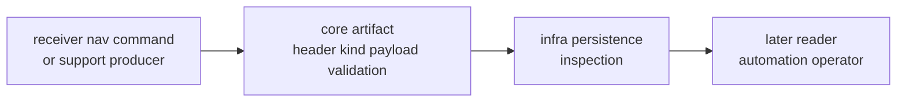

# Artifact Contracts

Core artifact contracts define the versioned envelope and payload meaning that
other crates can persist, inspect, export, and validate. Core owns the semantic
shape. Infra owns repository placement. Receiver, nav, and command crates own
the evidence they produce or present.

## Artifact Meaning Flow

## Owned Artifact Surface

| surface | core-owned meaning | outside owner |
| --- | --- | --- |
| `ArtifactHeaderV1` | version, identity, timestamp, and kind metadata | infra path and storage layout |
| `ArtifactV1` | envelope binding header to payload | command export and report routing |
| `ArtifactKind` | stable classification of acquisition, tracking, observation, nav, and support payloads | producer-specific runtime meaning |
| payload families | versioned acquisition, tracking, observation, navigation, and support-matrix payload shape | receiver and nav evidence production |
| `ArtifactPayloadValidate` and `ArtifactValidate` | semantic validation hooks for payload coherence | infra inspection workflow |
| read-policy and conversion helpers | shared API for safe artifact handling | storage and CLI presentation |

## Change Rules

- Add payload meaning through an explicit versioned family or backward-readable
  field.
- Keep filesystem names, run directories, and artifact indexes out of core.
- Keep runtime scheduling and diagnostic emission in receiver.
- Keep navigation solver behavior in nav.
- Update serialization docs and artifact validation tests when payload meaning
  changes.

## First Proof Check

Inspect `crates/bijux-gnss-core/src/artifact.rs`,
`crates/bijux-gnss-core/src/artifact/v1.rs`,
`crates/bijux-gnss-core/docs/CONTRACTS.md`,
`crates/bijux-gnss-core/docs/SERIALIZATION.md`,
`crates/bijux-gnss-core/tests/nav_artifact_validation.rs`, and
`crates/bijux-gnss-core/tests/tracking_artifact_validation.rs`.
