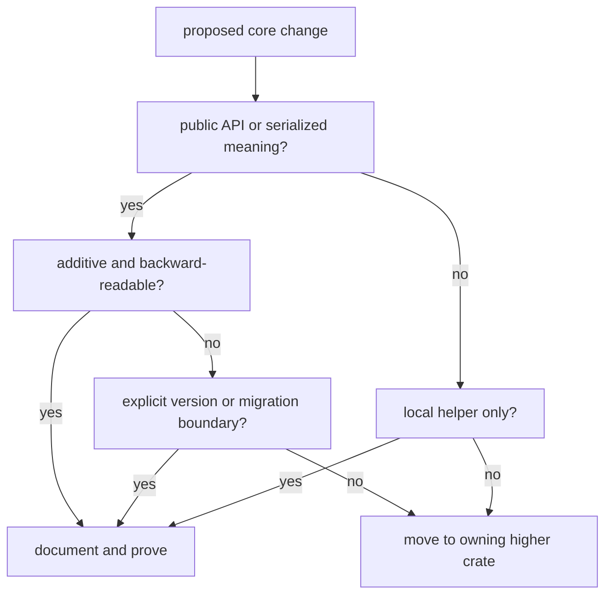

# Compatibility Commitments

Core compatibility protects shared meaning. Higher crates depend on
`bijux-gnss-core` for records, units, identifiers, time systems, diagnostics,
artifact envelopes, and serialized payload meaning. A compatibility change is
acceptable only when readers can tell whether the shared contract stayed
additive, moved behind an explicit version boundary, or intentionally changed.

## Compatibility Decision Route

## Commitments

| surface | compatibility promise | proof anchor |
| --- | --- | --- |
| curated public API | stable cross-crate exports enter through `bijux_gnss_core::api` | curated API source and public API guardrail |
| serialized artifacts | field meaning changes through explicit version boundaries | [serialization guide](../../../crates/bijux-gnss-core/docs/SERIALIZATION.md) and artifact validation tests |
| shared units and time | typed wrappers and time records keep meaning explicit | unit, time, and timekeeping proof |
| identifiers | constellation, satellite, signal, band, and code identity stay shared | identity source and support-matrix tests |
| observations and navigation records | higher crates exchange records without importing private layout | observation and navigation-solution source |
| diagnostics | severity, code, and event shape remain machine-readable | diagnostic source and [diagnostic guide](../../../crates/bijux-gnss-core/docs/DIAGNOSTICS.md) |

## Non-Commitments

- Private module layout is not stable API.
- One crate's local convenience helper does not become a core contract.
- Repository file layout belongs to infra, not core.
- Runtime scheduling belongs to receiver, not core.
- Command workflow behavior belongs to `bijux-gnss`, not core.

## Review Questions

- Does the change alter public exports, serialized meaning, or invariant
  expectations?
- Can older persisted records still be interpreted honestly?
- Is the new type shared by multiple crates, or is one caller pulling local
  behavior into core?
- Do `CONTRACTS.md`, `CONTRACT_MAP.md`, `SERIALIZATION.md`, and tests describe
  the same boundary?

## First Proof Check

Inspect the [core change rules](../../../crates/bijux-gnss-core/docs/CHANGE_RULES.md),
[public API](../../../crates/bijux-gnss-core/docs/PUBLIC_API.md),
[contract guide](../../../crates/bijux-gnss-core/docs/CONTRACTS.md),
[serialization guide](../../../crates/bijux-gnss-core/docs/SERIALIZATION.md),
[invariant guide](../../../crates/bijux-gnss-core/docs/INVARIANTS.md), and
public API guardrail proof.
