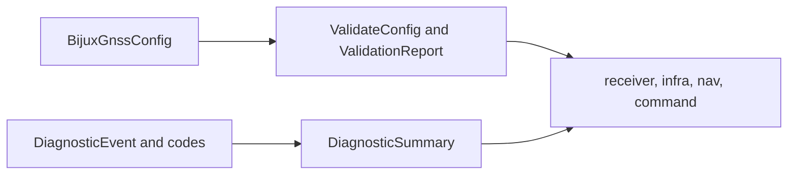

# Configuration and Diagnostics

Core owns the shared shape of configuration validation and diagnostic language.
It does not own how commands find config files, how receiver defaults are
chosen, or how operators see diagnostics.

## Contract Flow

## Configuration Contracts

| surface | owns | not owned here |
| --- | --- | --- |
| `BijuxGnssConfig` | cross-crate config record shape | CLI config discovery and output paths |
| `SchemaVersion` | schema-version language shared by validators | repository migration workflow policy |
| `ValidateConfig` | contract-level validation trait | receiver-specific default policy |
| `ValidationReport` | shared validation result shape | operator report styling |

## Diagnostic Contracts

| surface | owns | not owned here |
| --- | --- | --- |
| diagnostic codes | stable machine-readable warning and error vocabulary | runtime log routing |
| diagnostic events | structured event payload shape | command presentation |
| diagnostic summaries | aggregation shape and severity language | repository persistence layout |
| canonical error families | shared error taxonomy for higher crates | local error recovery policy |

## Boundary Rules

- Core diagnostic codes must be stable enough for receiver, infra, nav, and
  command layers to emit or aggregate without translating private strings.
- Runtime sinks and logging belong to receiver or command layers.
- Config file discovery, upgrade commands, and schema emission belong above
  core.
- Receiver-specific config defaults belong in receiver, even when validation
  reports use core shapes.

## First Proof Check

Inspect `crates/bijux-gnss-core/src/config.rs`,
`crates/bijux-gnss-core/src/diagnostic/`,
`crates/bijux-gnss-core/docs/DIAGNOSTICS.md`,
`crates/bijux-gnss-core/docs/CONTRACTS.md`, and any downstream tests that emit
or aggregate core diagnostics.
