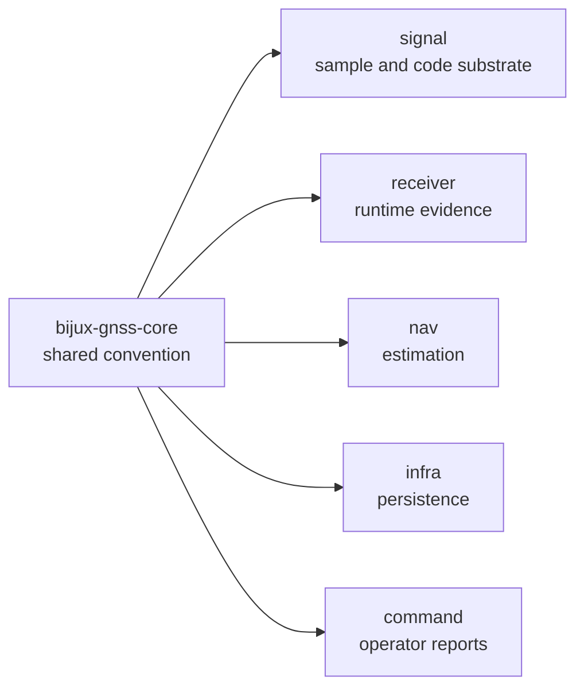

# Engineering Conventions

Core conventions are repository law for shared scientific meaning. They define
how higher crates interpret units, sign, time, coordinate frames, diagnostics,
and serialized records before any solver, runtime stage, command, or dataset
layout adds local behavior.

## Convention Flow

## Shared Conventions

| convention | core meaning | downstream obligation |
| --- | --- | --- |
| Doppler sign | `carrier_phase_increment(doppler_hz, dt_s)` computes `doppler_hz * dt_s`; positive Doppler increases carrier phase cycles over positive time | receiver and nav must not invert sign without documenting the local transform |
| carrier phase | cycle values use the `Cycles` unit wrapper | signal and receiver conversions must name wavelength or signal identity when converting to meters |
| pseudorange | meter values use the `Meters` wrapper and sanity checks compare timing-derived range | receiver and nav must preserve timing context when accepting or rejecting observations |
| CN0 | `cn0_dbhz` is a bounded observation quality value | receiver diagnostics must explain degraded or rejected quality instead of hiding it in thresholds |
| time | GPS, UTC, TAI, receiver sample time, and leap-second records are explicit types | command, receiver, infra, and nav must not rely on unnamed wall-clock context |
| coordinates | WGS-84, ECEF, ENU, and geodetic records keep frame meaning explicit | nav estimators and reports must name frame assumptions |
| diagnostics | severity, code, and event shape are shared records | receiver and command layers add runtime and reporting context without changing shared shape |
| serialization | versioned record meaning is preserved across crates | infra and command layers may store or export records but cannot redefine field meaning |

## Boundary Rule

Keep a convention in core when more than one crate must interpret the same
record the same way. Move the explanation out of core when the issue becomes:

- one signal family or modulation model
- one receiver stage, runtime loop, or lock policy
- one navigation solver, correction model, PPP rule, or RTK rule
- one persisted directory layout or dataset registry
- one operator command or report format

## Review Questions

- Does the convention use typed units instead of plain `f64` meaning?
- Does the sign convention have a reversible helper or a test?
- Does the time or coordinate convention name the frame explicitly?
- Does serialization preserve the same meaning for old and new readers?
- Does the downstream crate add behavior without changing the shared contract?

## First Proof Check

Inspect `crates/bijux-gnss-core/src/conventions.rs`,
`crates/bijux-gnss-core/src/units.rs`,
`crates/bijux-gnss-core/src/time.rs`,
`crates/bijux-gnss-core/src/geo.rs`,
`crates/bijux-gnss-core/src/observation/`,
`crates/bijux-gnss-core/docs/CONTRACTS.md`,
`crates/bijux-gnss-core/docs/INVARIANTS.md`, and
`crates/bijux-gnss-core/docs/SERIALIZATION.md`.
