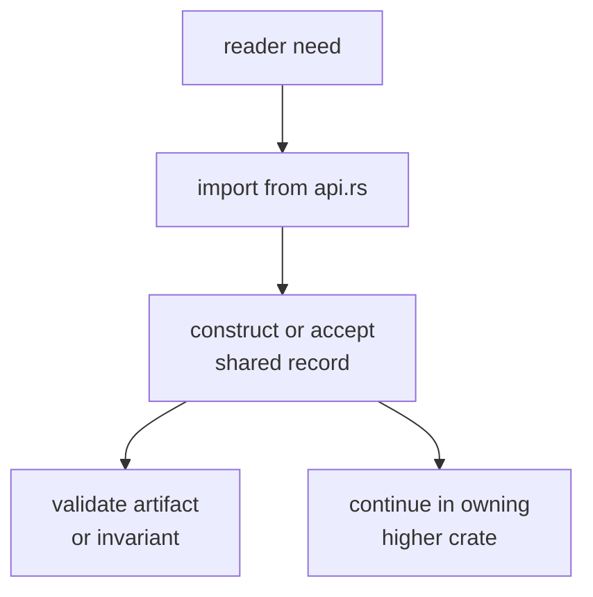

# Entrypoints and Examples

The main entrypoint is the curated import surface itself:
`bijux_gnss_core::api`. Core examples should show stable exchange records and
validation seams, not full receiver, navigation, or command workflows.

## Reader Route



## Example: Foundational Types

```rust
use bijux_gnss_core::api::{Constellation, GpsTime, SatId};

let sat = SatId { constellation: Constellation::Gps, prn: 7 };
let t = GpsTime { week: 2200, tow_s: 1000.0 };
```

## Example: Artifact Validation

```rust
use bijux_gnss_core::api::{ArtifactValidate, ArtifactV1};

fn validate(artifact: &ArtifactV1) -> bool {
    artifact.validate().is_ok()
}
```

## Example: Observation Contract Use

```rust
use bijux_gnss_core::api::ObsEpoch;

fn accept_epoch(_epoch: &ObsEpoch) {
    // Downstream crates consume the shared record shape without importing
    // private module paths.
}
```

## Example Standards

| example should show | because |
| --- | --- |
| import from `bijux_gnss_core::api` | private module paths are not the public contract |
| small records with obvious units | core owns vocabulary, not workflows |
| validation traits and reports | persisted meaning must be checkable |
| handoff to receiver, nav, signal, or infra | behavior belongs outside core when it is not foundational |

Avoid examples that run acquisition, solve navigation, inspect repository
state, or render CLI output. Those examples belong in the owning package docs.

## First Proof Check

Inspect `crates/bijux-gnss-core/src/api.rs`,
`crates/bijux-gnss-core/docs/PUBLIC_API.md`, and
`crates/bijux-gnss-core/docs/CONTRACTS.md`. Then inspect
`crates/bijux-gnss-core/tests/public_api_guardrail.rs` and the most relevant
artifact or timekeeping validation tests to confirm these examples still match
real contract entrypoints.
