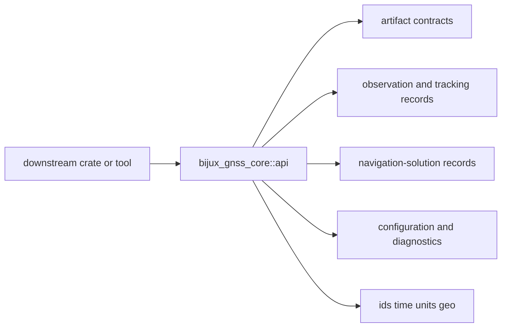

# Interfaces

Open this section when the question is contractual: which public imports,
artifact envelopes, records, and validation-facing shapes are safe for another
crate or tool to rely on.

## Contract Surface

`bijux-gnss-core` exposes one deliberate public module, but that module carries
multiple contract families: artifact envelopes, configuration and diagnostics,
foundational physical types, observation records, navigation-solution records,
and support-matrix meaning. The point of this section is to name those
promises before a reader has to reverse-engineer `api.rs`.

## Read These First

- open [API Surface](api-surface.md) first when the dispute is whether a type
  should be publicly exported at all
- open [Artifact Contracts](artifact-contracts.md) when the question is about
  persisted envelopes or payload validation
- open [Observation and Tracking Contracts](observation-and-tracking-contracts.md)
  when the issue is record meaning across signal, receiver, and nav work

## First Proof Check

- `crates/bijux-gnss-core/src/api.rs`
- `crates/bijux-gnss-core/docs/PUBLIC_API.md`
- `crates/bijux-gnss-core/docs/CONTRACTS.md`
- `crates/bijux-gnss-core/docs/SERIALIZATION.md`

## Pages In This Section

- [API Surface](api-surface.md)
- [Public Imports](public-imports.md)
- [Artifact Contracts](artifact-contracts.md)
- [Observation and Tracking Contracts](observation-and-tracking-contracts.md)
- [Navigation Solution Contracts](navigation-solution-contracts.md)
- [Configuration and Diagnostics](configuration-and-diagnostics.md)
- [Entrypoints and Examples](entrypoints-and-examples.md)
- [Compatibility Commitments](compatibility-commitments.md)

## Leave This Section When

- leave for [Foundation](../foundation/) when the contract dispute is really a
  package-boundary dispute
- leave for [Architecture](../architecture/) when the interface issue reveals
  structural drift underneath it
- leave for [Operations](../operations/) or [Quality](../quality/) when the
  contract is clear and the question becomes safe change or proof
