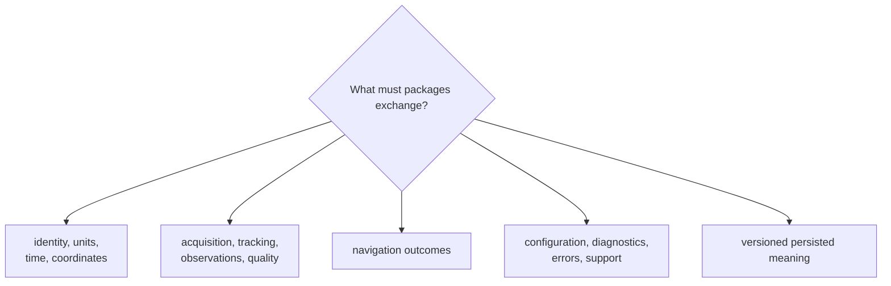
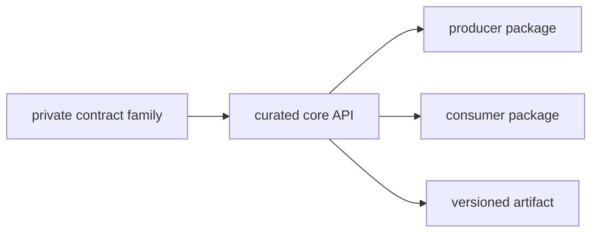

# Core Interface Guide

Downstream packages consume `bijux-gnss-core` through one curated API. That
surface publishes shared meaning, not implementation organization: identities,
units, time, coordinates, observations, navigation outcomes, diagnostics,
configuration records, support inventory, and versioned artifacts.

## Choose A Contract Family

| exchanged meaning | contract route | required clarity |
| --- | --- | --- |
| Satellite, signal, physical quantity, epoch, or coordinate | [Engineering conventions](engineering-conventions.md) | identity, unit, time scale, frame, sign, and valid range |
| Acquisition request or result, tracking state, observation, differencing, or quality evidence | [Observation and tracking contracts](observation-and-tracking-contracts.md) | lifecycle, uncertainty, timing, refusal, and producer responsibility |
| Measurement, engine-neutral boundary, or shared support record | [Measurement and engine contracts](measurement-and-engine-contracts.md) | stable data meaning without runtime scheduling |
| Position result, residual, validity, lifecycle, or inter-system bias | [Navigation solution contracts](navigation-solution-contracts.md) | frame, clock units, quality, covariance, integrity, and refusal |
| Configuration schema, diagnostic code, error category, or support status | [Configuration and diagnostics](configuration-and-diagnostics.md) | version, severity, ownership, and invalid states |
| Header, payload kind, reader policy, or versioned record | [Artifact contracts](artifact-contracts.md) | payload version, semantic validation, and compatibility policy |

## Import Through The Curated Surface

Private modules own implementation, but callers rely only on deliberate
exports. Use [public imports](public-imports.md) for supported patterns and
[API surface](api-surface.md) before proposing a new export.

If a caller cannot express its work through the curated API, first check
ownership. A receiver loop workspace, navigation filter state, repository path,
or command report type should not become core API merely to shorten an import.

## Read A Shared Record

Before consuming a record, identify:

- who produced it and which package owns that behavior;
- units, time scale, coordinate frame, sign, and ordering;
- valid, degraded, refused, unknown, and missing states;
- uncertainty, provenance, and model-version fields that qualify the value;
- payload version and reader policy if it survives serialization.

Parsing proves that bytes fit a shape. Contract validation determines whether
the fields are coherent. The producing package’s evidence determines whether
the scientific or runtime claim is supported.

## Compatibility Boundary

Public exports and serialized fields are compatibility commitments. Do not
change old meaning in place. Add a version boundary or documented reader policy
when old and new consumers cannot assign the same semantics to the same value.
Use [compatibility commitments](compatibility-commitments.md) before changing a
contract and [entrypoints and examples](entrypoints-and-examples.md) for
consumer-shaped use.

## Sources Of Truth

The [curated API](../../../crates/bijux-gnss-core/src/api.rs) is the supported
surface. The [contract map](../../../crates/bijux-gnss-core/docs/CONTRACT_MAP.md)
locates semantic ownership, the
[contract guide](../../../crates/bijux-gnss-core/docs/CONTRACTS.md) defines
families, and the
[serialization guide](../../../crates/bijux-gnss-core/docs/SERIALIZATION.md)
governs persisted meaning.
