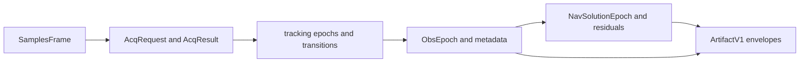

# Measurement And Engine Contracts

`bijux-gnss-core` owns the record meanings that must survive handoff between
signal, receiver, navigation, infrastructure, and command crates. These records
are not stage implementations; they are the shared language used by stage
implementations.

## Shared Measurement Flow

## Contract Families

| family | owns | first proof |
| --- | --- | --- |
| sample bridge | sample-frame records that cross source, signal, and receiver boundaries | observation source and [core contract guide](../../../crates/bijux-gnss-core/docs/CONTRACTS.md) |
| acquisition records | request/result records and explainability payload meaning | observation source |
| tracking records | tracking epochs, transitions, uncertainty, and channel-state language | observation source |
| observation records | `ObsEpoch`, metadata, receiver roles, timing, rejection, and uncertainty classes | observation source |
| navigation-solution records | solution epochs, residuals, validity, lifecycle, and refusal classes | navigation-solution source |
| artifact envelopes | versioned cross-crate artifact headers, payload kinds, and validation traits | artifact source |

## Boundary Rules

- Core owns what exchanged records mean.
- Signal owns reusable signal computation before receiver stage execution.
- Receiver owns stage ordering and runtime artifacts that use these records.
- Navigation owns solver behavior that consumes and emits these records.
- Infra owns repository persistence around these records.
- Command owns operator routes and reports over these records.

## Reader Checks

- Is the record shared by more than one crate?
- Would changing it alter persisted artifact interpretation or downstream
  solver assumptions?
- Can higher crates use the record without importing runtime, filesystem, or
  command policy?
- Does the proof live in core tests or in the crate that implements behavior
  over the record?

## First Proof Check

Inspect the [core contract guide](../../../crates/bijux-gnss-core/docs/CONTRACTS.md),
[contract map](../../../crates/bijux-gnss-core/docs/CONTRACT_MAP.md), and
[serialization guide](../../../crates/bijux-gnss-core/docs/SERIALIZATION.md).
Then inspect artifact, observation, and navigation-solution source for the
record family that moved.
