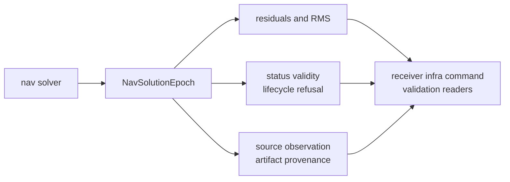

# Navigation Solution Contracts

Navigation-solution records describe solver output in a form that receiver,
infra, command, and validation readers can exchange. Core owns the record shape
and serialized meaning. `bijux-gnss-nav` owns the algorithms that compute the
solution.

## Solution Payload Map

## Record Families

| family | records and fields | shared promise |
| --- | --- | --- |
| epoch position | `NavSolutionEpoch`, ECEF, geodetic position, receiver time | downstream readers can identify the solved state and epoch |
| residual evidence | `NavResidual`, `NavConstellationResidualRms` | accepted and rejected measurements remain inspectable |
| clock and biases | `clock_bias_s`, `clock_bias_m`, `clock_drift_s_per_s`, `InterSystemBias` | timing and constellation bias evidence stays explicit |
| quality and validity | `SolutionStatus`, `SolutionValidity`, `NavQualityFlag` | readers can distinguish valid, degraded, refused, and invalid output |
| lifecycle and refusal | `NavLifecycleState`, `NavRefusalClass`, health events | solver refusal and lifecycle state survive serialization |
| uncertainty and integrity | covariance, sigma, DOP, HPL, VPL, innovation fields | uncertainty is carried as evidence, not implied by success |
| provenance | artifact id, source observation epoch id, assumptions, provenance | downstream readers can route back to source evidence |

## Boundary Decisions

- Add fields here only when multiple crates need shared solution meaning.
- Keep estimator internals, filter state, ambiguity search, and correction
  implementation in nav.
- Keep artifact storage, run layout, and inspection workflows in infra.
- Keep operator report selection in the command crate.
- Preserve serialized meaning with explicit defaults or version boundaries.

## First Proof Check

Inspect `crates/bijux-gnss-core/src/nav_solution.rs`,
`crates/bijux-gnss-core/src/observation/navigation.rs`,
`crates/bijux-gnss-core/docs/CONTRACTS.md`,
`crates/bijux-gnss-core/docs/SERIALIZATION.md`,
`crates/bijux-gnss-core/docs/INVARIANTS.md`,
`crates/bijux-gnss-core/tests/nav_artifact_validation.rs`, and downstream nav
tests that construct or consume `NavSolutionEpoch`.
