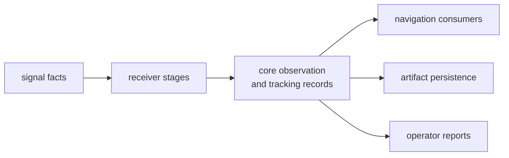

# Observation and Tracking Contracts

Observation and tracking records are shared language at the boundary between
signal facts, receiver runtime, navigation interpretation, and persisted
artifacts. Core owns the record meaning; higher crates own the behavior that
creates or consumes those records.

## Record Flow

## Record Families

| family | record meaning | behavior owner |
| --- | --- | --- |
| acquisition | requests, results, hypotheses, evidence, refinement, uncertainty | receiver acquisition |
| tracking | epochs, transitions, lifecycle state, assumptions, uncertainty | receiver tracking |
| observations | epoch measurements, manifests, decisions, support classes, uncertainty classes | receiver observation construction and nav consumption |
| quality | measurement quality, covariance status, rejection reasons | receiver and nav interpretation |
| differencing | single- and double-difference records | nav and RTK consumers |
| signal timing | travel time, transmit time, and delay alignment evidence | receiver production, nav use |

## Boundary Decisions

- Core records must stay solver-neutral and runtime-neutral.
- Receiver owns how acquisition, tracking, and observations are produced.
- Signal owns reusable code and DSP facts used by receiver.
- Nav owns estimator, correction, PPP, RTK, and differencing behavior.
- Infra owns persistence of these records after they become artifacts.

## First Proof Check

Inspect `crates/bijux-gnss-core/src/observation/`,
`crates/bijux-gnss-core/src/observation_quality.rs`,
`crates/bijux-gnss-core/docs/CONTRACTS.md`,
`crates/bijux-gnss-core/docs/SERIALIZATION.md`,
`crates/bijux-gnss-core/tests/tracking_artifact_validation.rs`, and receiver or
nav tests that serialize or consume observation records.
