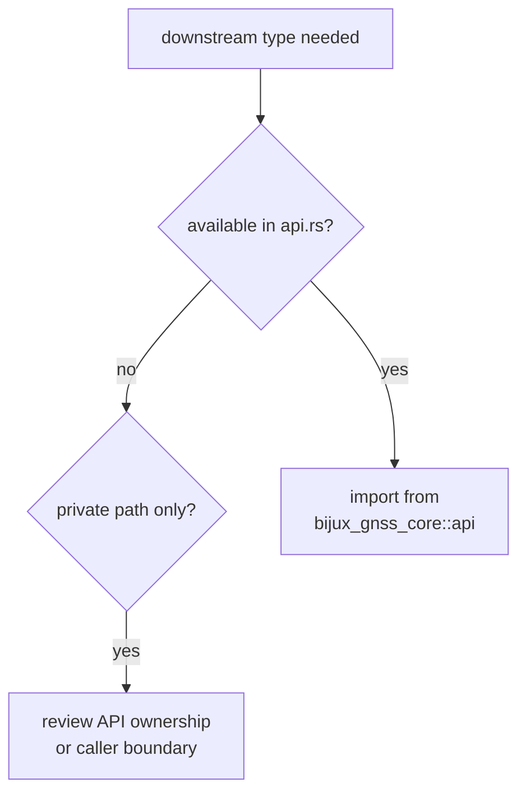

# Public Imports

Downstream crates should import shared core meaning through
`bijux_gnss_core::api`, not through private module paths. The import line should
make the stable contract obvious to a reviewer.

## Import Decision



## Import Families

| family | import through `api` when the caller needs | do not import for |
| --- | --- | --- |
| artifacts | durable persisted envelopes and validation traits | serializer internals |
| configuration and diagnostics | shared validation and failure language | local command formatting |
| identity, time, units, geometry | foundational GNSS facts | one-module convenience aliases |
| acquisition and tracking | receiver evidence record shape | receiver loop internals |
| observation quality and differencing | cross-crate measurement quality and differenced records | estimator scratch state |
| navigation solution and support matrix | solver-neutral solution status and support inventory | nav solver private bookkeeping |

## Import Rule

If a downstream crate needs a type that exists only in a private module path,
that is a signal to review whether the type should be re-exported or whether
the downstream crate is reaching too far inward.

## Good Import Shape

```rust
use bijux_gnss_core::api::{GpsTime, ObsEpoch, SatId, ValidationReport};
```

## Bad Import Shape

```rust
use bijux_gnss_core::observation::epochs::ObsEpoch;
```

The second style couples callers to layout instead of to the stable public
surface.

## Review Checks

- Does the import name explain the shared meaning without exposing module
  layout?
- Would moving a private source module break the caller unnecessarily?
- Is the type stable enough to be a cross-crate contract?
- Should the behavior move to the owning crate instead of widening core?
- Do tests protect the public import when a downstream crate already depends on
  it?

## First Proof Check

Inspect `crates/bijux-gnss-core/src/api.rs`,
`crates/bijux-gnss-core/docs/PUBLIC_API.md`, and
`crates/bijux-gnss-core/tests/public_api_guardrail.rs` to confirm the import
families documented here still match the curated public surface.
