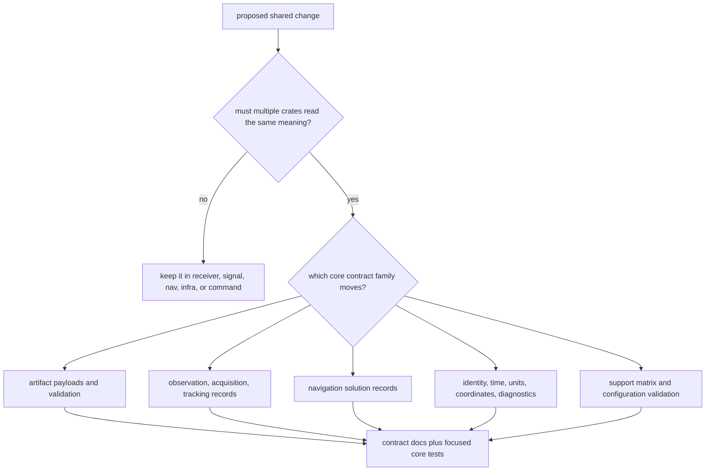

# Change Sequence

Use this sequence when a change affects shared records, validation meaning,
serialization, diagnostics, identities, time, units, or support-matrix
contracts. Core changes are expensive because every higher crate may interpret
the same type differently if the contract is vague.

## Decision Flow

## Change Sequence

1. Decide whether multiple crates need one shared interpretation.
2. Identify the contract family in `crates/bijux-gnss-core/docs/CONTRACTS.md`
   and `CONTRACT_MAP.md`.
3. Inspect the owning source family before changing downstream callers.
4. Update crate-local docs when serialized meaning, validation, or public API
   changes.
5. Update this handbook when a reader-facing package route changes.
6. Run the focused core test that protects the moved contract.
7. Only then inspect receiver, nav, infra, signal, or command fallout.

## Proof Selection

| change family | first proof |
| --- | --- |
| public exports | `cargo test -p bijux-gnss-core --test public_api_guardrail` |
| navigation artifact payloads | `cargo test -p bijux-gnss-core --test nav_artifact_validation` |
| tracking artifact payloads | `cargo test -p bijux-gnss-core --test tracking_artifact_validation` |
| timekeeping and units | `cargo test -p bijux-gnss-core --test prop_timekeeping` |
| workspace guardrails | `cargo test -p bijux-gnss-core --test integration_guardrails` |

Skipping ownership review is the expensive mistake. A downstream owner is often
cleaner than turning a local convenience type into a permanent shared contract.
