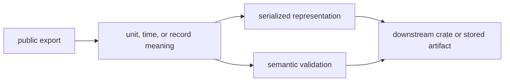

# Release and Versioning

`bijux-gnss-core` defines records that every higher crate exchanges. A release
decision must therefore cover both Rust source compatibility and scientific or
serialized meaning. Compilation alone cannot prove that a core change is safe.

## Decide the Compatibility Level

| changed surface | release decision |
| --- | --- |
| new public item with no changed defaults or serialized fields | usually additive; inspect exhaustive matches and feature exposure |
| validation rejects a state that was previously accepted | document the rejected state and prove it violated an existing invariant |
| serialized field, enum variant, tag, or default | treat as a data-compatibility change; add a payload version when old readers cannot preserve meaning |
| unit, coordinate frame, time-system, or identifier interpretation | breaking unless the old meaning remains available through a distinct type or version |
| new diagnostic code | additive when existing code meanings and severities stay unchanged |
| changed diagnostic condition or severity | machine-readable behavior change; review every producer and consumer |
| curated export removed, renamed, or moved | breaking public API change |

"Internal" is not an adequate classification when a change touches a shared
record, validator, conversion, diagnostic, or artifact payload.

## Trace the Contract

Start with the [public API guide](../../../crates/bijux-gnss-core/docs/PUBLIC_API.md)
and the [curated export module](../../../crates/bijux-gnss-core/src/api.rs).
Use the [contract catalog](../../../crates/bijux-gnss-core/docs/CONTRACTS.md) to
identify the owning contract family, then inspect:

- the [invariant guide](../../../crates/bijux-gnss-core/docs/INVARIANTS.md) for
  promises downstream crates already rely on
- the [serialization guide](../../../crates/bijux-gnss-core/docs/SERIALIZATION.md)
  when persisted shape or meaning can change
- the [diagnostic guide](../../../crates/bijux-gnss-core/docs/DIAGNOSTICS.md)
  when codes, severities, aggregation, or context change
- the [support matrix guide](../../../crates/bijux-gnss-core/docs/SUPPORT_MATRIX.md)
  when capability claims change

## Require Matching Evidence

| claim | minimum evidence |
| --- | --- |
| curated exports remain intentional | [public API guardrail](../../../crates/bijux-gnss-core/tests/public_api_guardrail.rs) |
| artifact payloads remain coherent | [navigation artifact validation](../../../crates/bijux-gnss-core/tests/nav_artifact_validation.rs) and [tracking artifact validation](../../../crates/bijux-gnss-core/tests/tracking_artifact_validation.rs) |
| time conversion meaning is preserved | [timekeeping properties](../../../crates/bijux-gnss-core/tests/prop_timekeeping.rs) and the [retained regression corpus](../../../crates/bijux-gnss-core/tests/prop_timekeeping.proptest-regressions) |
| dependency direction remains valid | [core boundary guardrails](../../../crates/bijux-gnss-core/tests/integration_guardrails.rs) |

Update a fixture only when the new bytes represent an intentional new contract.
Never replace expected data merely to make a changed serializer pass.

## Write the Release Entry

The [package changelog](../../../crates/bijux-gnss-core/CHANGELOG.md) must name:

- the affected public type, artifact version, diagnostic, or invariant
- whether Rust callers, stored artifacts, or downstream scientific meaning
  changes
- how old data and old callers behave after the release
- the evidence that supports the compatibility claim

The workspace version and publication procedure are defined in the
[release handbook](../../07-bijux-gnss-dev/operations/release-and-versioning.md).
