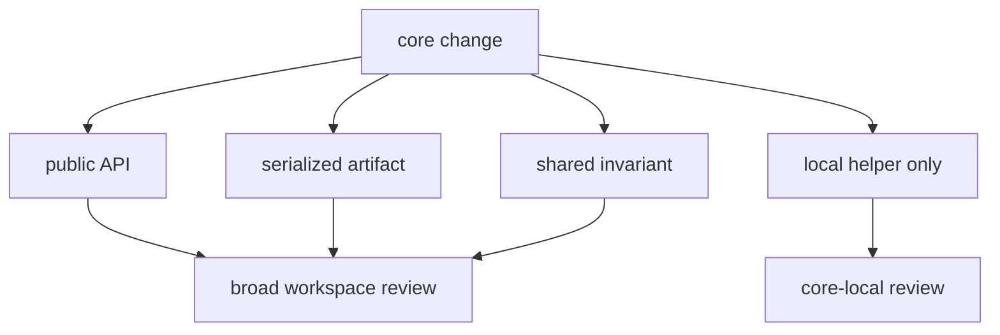

# Review Scope

Review `bijux-gnss-core` changes by contract blast radius, not by diff size.
Core is where shared meaning hardens. A small type rename, unit conversion, or
serialized field change can affect command output, receiver artifacts, infra
validation, and navigation calculations at once.

## Always Ask

- Did this change expand the public surface?
- Did serialized meaning change?
- Did a unit, coordinate, time, diagnostic, or artifact invariant move?
- Does a stronger downstream owner exist?
- Did docs and protecting tests move with the contract?

## Raise The Review Bar For

| surface | why it is review-sensitive |
| --- | --- |
| curated public API | downstream crates use it as stable vocabulary |
| artifact envelopes | persisted evidence must remain readable after code moves |
| time, unit, coordinate, and identity records | silent interpretation drift corrupts downstream math |
| observation and navigation-solution records | receiver and navigation crates exchange these as truth-bearing data |
| diagnostics and support matrices | command and infra surfaces present them to readers |

## Proof Path

Use the [core public API guide](../../../crates/bijux-gnss-core/docs/PUBLIC_API.md),
[core contract guide](../../../crates/bijux-gnss-core/docs/CONTRACTS.md), and
[core test guide](../../../crates/bijux-gnss-core/docs/TESTS.md) as the review
map. Then inspect the changed source family and matching tests so review depth
follows contract risk rather than line count.
