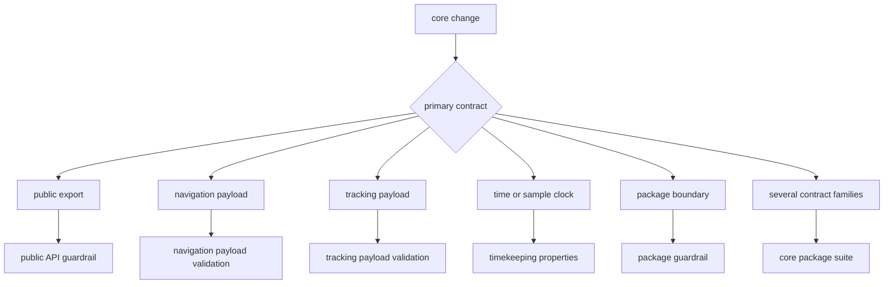
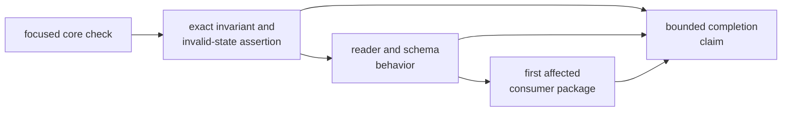

# Core Verification Guide

Run the command that exercises the changed contract, then inspect whether its
evidence reaches the public, serialized, and downstream surfaces affected by
the change. A larger command is not automatically stronger proof.

## Select the First Command



Run from the repository root:

```sh
cargo test -p bijux-gnss-core --test public_api_guardrail
cargo test -p bijux-gnss-core --test nav_artifact_validation
cargo test -p bijux-gnss-core --test tracking_artifact_validation
cargo test -p bijux-gnss-core --test prop_timekeeping
cargo test -p bijux-gnss-core --test integration_guardrails
cargo test -p bijux-gnss-core
```

## Interpret Each Result Narrowly

| Command | Supports | Does not establish |
| --- | --- | --- |
| Public API guardrail | public structs and free functions found in implementation modules are represented by the curated API | complete Rust API analysis or semantic compatibility |
| Navigation artifact validation | selected version, count, clock, residual, covariance, and finite-value rules produce expected diagnostics | navigation solver accuracy or every navigation payload invariant |
| Tracking artifact validation | selected uncertainty and navigation-bit-sign rules produce expected diagnostics | tracking lock, continuity, or full schema coverage |
| Timekeeping properties | generated GPS-second round trips, sample-clock monotonicity, and retained regressions in the current domains | every leap, rollover, invalid-rate, or time-system boundary |
| Package guardrail | shared repository source and API policy | contract meaning, serialization compatibility, or complete dependency review |
| Core package suite | the union of current package tests | correctness of receiver, navigation, infrastructure, or command use |

The [core test guide](../../../crates/bijux-gnss-core/docs/TESTS.md) is the
authority for current coverage. Read it before broadening a claim from a green
exit status.

## Add the Missing Evidence Layer



Not every change needs every layer. A private arithmetic correction may need a
reference and property boundary but no serialized reader. A public artifact
record usually needs all layers.

## Verification Routes

### Public Contracts

Run the surface guardrail, then compile and exercise the item through the
supported API in a consumer-shaped test. Add direct proof for enums, traits,
constants, aliases, and methods because the current scanner does not find
them.

### Artifact Contracts

Start with the payload family’s validation suite. Include one coherent record
and change one invalid condition at a time. Assert diagnostic code and severity,
not only that “an error” occurred. Add reader compatibility evidence when
schema, field, default, or enum meaning changes.

### Time, Units, and Coordinates

Use independent reference examples and properties over the supported domain.
State units and derive tolerances. Add the actual boundary that motivated the
change; a broad generated range may still omit leaps, rollovers, poles, or
invalid inputs.

### Dependency and Ownership

Inspect the production and development dependency sections separately. The
package guardrail is relevant policy evidence, but the
[dependency guide](../foundation/dependencies-and-adjacencies.md) still
requires semantic and manifest review.

## Stop on Misleading Success

- only the package suite ran, and the changed invariant is unnamed
- a public guardrail passed for an API surface it cannot detect
- a valid artifact case is used to claim invalid-state coverage
- an unreferenced fixture is counted as an executed test
- a core result is used to claim downstream workflow or scientific correctness
- generated properties omit the boundary described in the change

Use [contract change validation](../quality/change-validation.md) to assemble
the complete evidence set and [numerical budgets](../quality/numerical-budgets.md)
when a tolerance is involved.

Verification is complete when the command, exercised invariant, input domain,
unsupported surface, consumer boundary, and remaining gap are all reported
with the result.
