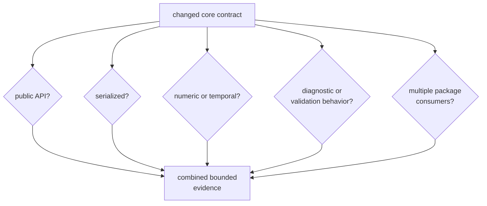
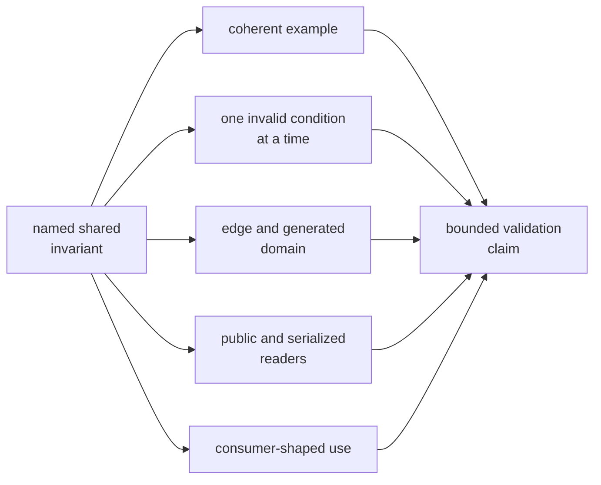

# Validating Core Contract Changes

Core validation starts with the shared meaning that moved. Compilation proves
that callers still type-check; it does not prove they assign the same units,
frames, defaults, validity, ordering, diagnostic meaning, or serialized
interpretation.

## Identify the Compatibility Surfaces

Several answers can be yes. A public time record stored in an artifact needs
API, numerical, serialization, validation, and consumer evidence.

## Evidence by Contract Family

| Changed meaning | Focused evidence | Additional review |
| --- | --- | --- |
| Identity, status, ordering, or version | exact examples, invalid lookup or constructor cases, and stable ordering | serialized representation and exhaustive downstream matches |
| Time, units, or coordinates | independent reference points, algebraic properties, boundary cases, and derived tolerances | all consumers that convert, compare, or display the value |
| Observation, tracking, or navigation record | coherent value plus one-invariant-at-a-time invalid records | producer and consumer interpretation |
| Artifact envelope or payload | supported-version policy, semantic validation, independent fixture, and refusal of unsupported data | old-reader and new-reader behavior |
| Diagnostic code, severity, context, or aggregation | exact structured-field assertions | every machine reader and persisted report |
| Public export | curated API guardrail plus direct consumer-shaped use | feature exposure and semantic compatibility |
| Dependency or ownership boundary | production manifest review and package guardrail | prove the concept remains independent of higher-package policy |

The [test evidence guide](../../../crates/bijux-gnss-core/docs/TESTS.md)
documents current checks and their limits. The
[contract catalog](../../../crates/bijux-gnss-core/docs/CONTRACTS.md) identifies
the owning semantic family.

## Build Evidence from the Invariant

Do not begin with a command list. First write the invariant in reader terms,
then choose the check that can fail when that invariant moves.

## Preserve Exact Meaning

Assert identifiers, enum variants, versions, ordering, validity, refusal,
diagnostic codes, and discrete states exactly. Numeric tolerances belong only
to quantities whose unit, reference value, and error budget are explicit.

For time and coordinates, include boundaries relevant to the API rather than
only round trips over ordinary positive values. The current property coverage
is useful but not exhaustive across leap boundaries, week rollover, invalid
rates, poles, antimeridian behavior, negative altitude, or all time-system
conversions.

## Treat Serialization as Reader Behavior

Parsing is not semantic validation. For a serialized change:

1. state the old and new meanings
2. identify supported schema versions
3. prove coherent current data
4. mutate one cross-field invariant at a time
5. define unsupported-version refusal
6. exercise old and new reader expectations
7. keep fixtures independent of the writer being judged

The checked-in observation record remains dormant until an active test reads
and validates it. Do not cite its presence as compatibility evidence.

## Respect Guardrail Limits

The public-surface guardrail scans source text for public structs and free
functions. It does not discover enums, traits, constants, aliases, methods, or
semantic changes. Add direct evidence for those surfaces.

The package guardrail enforces repository policy, not scientific meaning or
dependency architecture by itself. Artifact tests cover selected navigation
and tracking invariants, not every payload family.

## Reject Weak Validation

- the package compiles but no consumer-shaped semantic assertion exists
- a broad package test is cited without naming the changed invariant
- a fixture is regenerated from the changed serializer
- one valid payload is used to claim invalid-state coverage
- a tolerance hides changed identity, version, status, or ordering
- a core test is used to claim receiver or navigation algorithm correctness
- a source-scanning guardrail is described as complete API analysis

Use [verification commands](../operations/verification-commands.md) after the
evidence route is chosen, and [core evidence risks](risk-register.md) to record
coverage gaps.

A core change is validated when its shared invariant, exact and numerical
meaning, public surface, serialization policy, invalid states, real consumers,
and residual limits are all reviewable.
