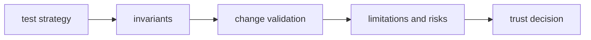

# Quality

Open this section when the question is whether `bijux-gnss-core` is proving
its contract claims strongly enough: invariants, tests, limitations, risk, and
review posture.

Quality is especially important in a foundational crate because green tests
alone can hide contract drift until every downstream crate has already adapted
to it.

## Trust Model

## Read These First

- open [Test Strategy](test-strategy.md) first when you need the broad proof
  shape
- open [Invariants](invariants.md) when the question is what downstream crates
  may safely assume
- open [Change Validation](change-validation.md) when you need the minimum
  proof for a safe contract change

## First Proof Check

- `crates/bijux-gnss-core/docs/INVARIANTS.md`
- `crates/bijux-gnss-core/docs/TESTS.md`
- `crates/bijux-gnss-core/tests/`

## Pages In This Section

- [Test Strategy](test-strategy.md)
- [Invariants](invariants.md)
- [Change Validation](change-validation.md)
- [Review Checklist](review-checklist.md)
- [Definition of Done](definition-of-done.md)
- [Known Limitations](known-limitations.md)
- [Risk Register](risk-register.md)

## Leave This Section When

- leave for [Foundation](../foundation/) when the doubt is still about what
  belongs in the crate
- leave for [Interfaces](../interfaces/) when the real question is what public
  promise exists, not how well it is defended
