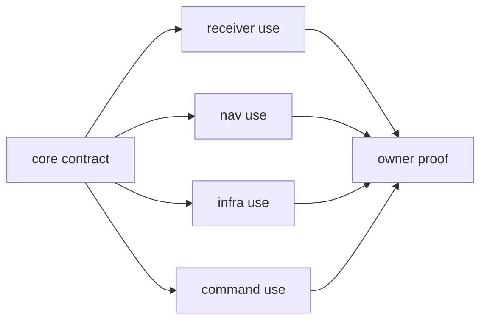

# Known Limitations

`bijux-gnss-core` is deliberately strong on shared record meaning, but that
strength has limits.

## Limits Readers Should Know

| limitation | consequence | honest reading |
| --- | --- | --- |
| Shared records are not workflow proof. | A valid record can still be used poorly by receiver, nav, infra, or command code. | Pair core proof with owner proof when the claim reaches a workflow. |
| Artifact validation is shape and contract validation. | It proves version, payload coherence, and value constraints, not full scientific correctness. | Treat artifact tests as contract proof, not end-to-end truth proof. |
| Public API curation needs consumer discipline. | Downstream crates can still build fragile paths if they bypass `api.rs` indirectly. | Review downstream imports when a core surface moves. |
| Serialization rules are only as strong as their fixtures. | Uncovered payload families may need new fixtures before a broad compatibility claim is honest. | Add or name fixture gaps when serialized meaning changes. |
| Foundational math and time helpers are shared primitives. | They do not imply ownership of receiver timing policy or navigation estimation policy. | Route policy claims to the owner that executes them. |

## Boundary Flow

The core proof says the shared meaning is coherent. The owner proof says a
consumer used it correctly.

## First Proof Route

Inspect `crates/bijux-gnss-core/docs/CONTRACTS.md`,
`crates/bijux-gnss-core/docs/INVARIANTS.md`, and
`crates/bijux-gnss-core/docs/TESTS.md`. Then inspect artifact, timekeeping,
and public API guardrail tests to confirm the limits described here are still
honest relative to the actual proof surface.

If a documentation sentence claims workflow behavior, do not anchor it only in
core. Route the reader to the crate that executes that workflow.
