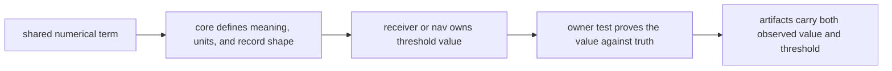

# Numerical Budgets

`bijux-gnss-core` owns shared numerical language, not every threshold value.
Use this page when a tolerance, residual, uncertainty, unit, or budget field
has to mean the same thing to more than one crate. Leave the exact acceptance
numbers with the runtime or navigation owner that proves them.

## What Core Owns

| shared budget concept | core responsibility | owning proof outside core |
| --- | --- | --- |
| sample, chip, carrier, Doppler, pseudorange, phase, and CN0 units | Keep units and record fields unambiguous across crates. | Receiver acquisition, tracking, and observation budget tests. |
| residual, PDOP, clock-bias, and position-error fields | Define the record meaning so navigation and receiver artifacts agree. | Navigation estimator tests and receiver PVT budget tests. |
| artifact threshold fields | Make observed values and threshold values readable by downstream consumers. | Receiver artifact and validation-report tests. |
| serialized diagnostic and artifact records | Preserve field meaning across readers and versions. | Core artifact validation plus receiver/nav serialization tests. |

## What Core Must Not Own

- The hard threshold values for a synthetic receiver scenario.
- Solver-specific convergence limits or integrity policy.
- Runtime gating behavior such as when a receiver declares lock or degrades a
  channel.
- Repository persistence policy for where budget reports are written.

## Review Rule

If a change renames a budget field, changes a unit, or changes what an error
value represents, review it as a core contract change. If a change only adjusts
the accepted numeric threshold for one receiver or navigation proof family,
review it in that owning crate and update this page only if shared meaning
moved.

## First Proof Check

- `crates/bijux-gnss-core/docs/INVARIANTS.md`
- `crates/bijux-gnss-core/docs/TESTS.md`
- `crates/bijux-gnss-core/tests/nav_artifact_validation.rs`
- `../../05-bijux-gnss-receiver/quality/test-strategy.md`
- `../../05-bijux-gnss-receiver/quality/validation-budgets.md`
- `../../04-bijux-gnss-nav/quality/test-strategy.md`

## Reader Path

Start here to learn what a budget field means. Then move to the receiver or
navigation budget test that proves the accepted value. A reader should never
have to infer units or threshold meaning from one integration assertion.
