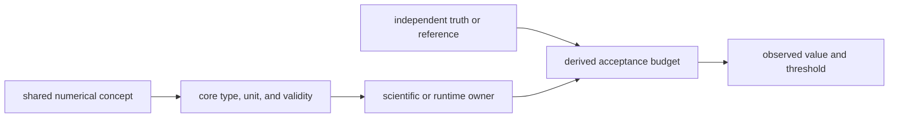
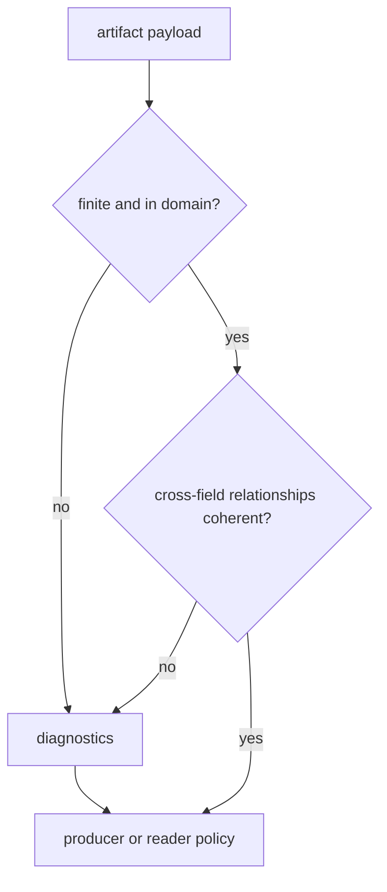

# Numerical Evidence

`bijux-gnss-core` defines the meaning, units, and validity of numerical values
shared across packages. It does not set every scientific acceptance threshold.
A receiver lock budget belongs to the receiver; a position or integrity budget
belongs to navigation. Core makes those budgets unambiguous and portable.

## Ownership Flow



This separation prevents a shared record from silently importing the policy of
one scenario while still ensuring that every consumer interprets its fields the
same way.

## Four Kinds Of Numerical Claim

| claim | appropriate assertion | typical owner |
| --- | --- | --- |
| exact representation | equality of identities, enum variants, integer counts, version fields, ordering keys, and bipolar signs | core |
| domain validity | finite values, non-negative uncertainty, bounded angles, coherent counts, positive rates, and valid covariance | core record validator |
| numerical identity | round trips, unit conversions, phase/frequency relationships, and coordinate transforms within a derived tolerance | core primitive |
| scientific acceptance | acquisition error, tracking stability, residual quality, protection level, convergence, or position accuracy against truth | receiver, signal, or navigation |

Do not use approximate assertions for exact contracts. Do not turn a
scenario-specific accuracy limit into a universal core invariant.

## Deriving A Tolerance

A tolerance needs a source. Acceptable sources include:

- input quantization or timestamp resolution;
- published uncertainty in a reference dataset;
- an analytical floating-point error bound;
- convergence error from a documented iterative method;
- a physical noise or dynamics model;
- an allocated share of a larger end-to-end error budget.

For a reference value that crosses zero or spans several magnitudes, combine an
absolute floor and relative term:

```text
absolute_error <= max(absolute_floor, relative_fraction * abs(reference))
```

Record both terms and their derivation. A decimal copied from the current output
is not a budget; it is a regression snapshot without justification.

### Tightening And Loosening

- Tighten a tolerance only when the reference and implementation precision
  support the smaller bound across the intended domain.
- Loosen a tolerance only with evidence that the previous model omitted a real
  uncertainty source or covered an invalid domain. A failing test is evidence
  of disagreement, not evidence that the threshold is wrong.
- Keep tolerances local to the narrowest proof. Reusing one convenient epsilon
  for seconds, meters, radians, and dimensionless values destroys physical
  meaning.
- Prefer error messages that report reference value, observed value, absolute
  error, allowed error, units, and scenario identity.

## Core Numerical Contracts

| surface | core guarantee | stronger proof elsewhere |
| --- | --- | --- |
| strong units and conversions | values carry shared physical meaning and conversion helpers preserve the documented relationship | signal timing, receiver tracking, and navigation estimation |
| GPS, UTC, TAI, and sample time | conversions are deterministic for an explicit leap-second table and sample rate | capture alignment and receiver epoch behavior |
| WGS-84 coordinates | coordinate records and transforms use declared frames and units | navigation reference-data accuracy |
| acquisition, tracking, observation, and navigation records | fields have stable meaning and validators reject or diagnose incoherent numerical payloads | stage accuracy and end-to-end truth comparisons |
| covariance, uncertainty, residual, and DOP fields | non-finite or structurally inconsistent claims are visible to validation | estimator calibration and integrity performance |
| artifact budget fields | readers can distinguish an observed value from its threshold and preserve both through the contract | owning artifact producer and scenario proof |

Core validation is not scientific certification. For example, a finite positive
covariance can be internally valid while still underestimating real error.
Calibration must be proved by the estimator or runtime that produced it.

## Artifact Validation Semantics



The [navigation artifact evidence](../../../crates/bijux-gnss-core/tests/nav_artifact_validation.rs)
checks model versions, satellite counts, clock-bias units, DOP values, residual
counts, covariance values, position sigmas, and error-ellipse fields. The
[tracking artifact evidence](../../../crates/bijux-gnss-core/tests/tracking_artifact_validation.rs)
checks uncertainty and navigation-bit sign validity.

Validators return diagnostics. The diagnostic severity and the consuming
workflow determine whether a condition rejects an artifact or remains a warning.
Documentation must not describe every diagnostic as a hard failure.

## Where To Find Acceptance Budgets

- Receiver acquisition, tracking, observation, clock, and PVT thresholds are
  explained in [receiver validation budgets](../../05-bijux-gnss-receiver/quality/validation-budgets.md).
- Navigation estimator and reference-data claims belong in the
  [navigation test strategy](../../04-bijux-gnss-nav/quality/test-strategy.md).
- Shared contract invariants and current proof limits are described in
  [core invariants](invariants.md) and the [core test strategy](test-strategy.md).

When a field changes name, unit, frame, sign, or interpretation, review it as a
core contract change even if the threshold remains owned elsewhere.

## Review Questions

- Is the assertion exact, domain-validating, numerically approximate, or
  scientifically budgeted?
- Are units and coordinate or time frames explicit?
- Can a reviewer trace every tolerance to quantization, analysis, reference
  uncertainty, or a physical model?
- Does the test cover both the nominal domain and numerically difficult
  boundaries?
- Does persisted evidence carry the observed value and the applied threshold?
- Is a higher-level package attempting to redefine shared numerical meaning?
