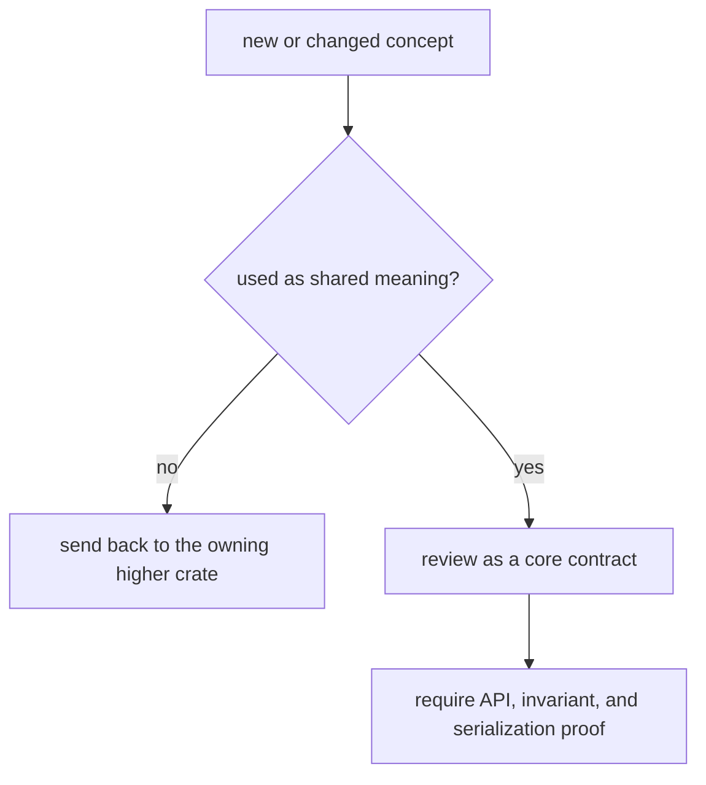

# Review Checklist

Review `bijux-gnss-core` as the shared vocabulary and artifact-contract
owner. A good core change makes downstream code less ambiguous. A bad core
change imports one higher-level crate's convenience and makes every caller
inherit it as shared meaning.

## Review Gates

| changed surface | accept only when | inspect before accepting |
| --- | --- | --- |
| public export in `api.rs` | The exported type or helper is shared meaning, not one caller's adapter. | `crates/bijux-gnss-core/src/api.rs`, `crates/bijux-gnss-core/tests/public_api_guardrail.rs`, [API Surface](../interfaces/api-surface.md) |
| observation, tracking, or measurement record | The record can be read consistently by command, receiver, navigation, and artifact consumers. | [Observation And Tracking Contracts](../interfaces/observation-and-tracking-contracts.md), [Measurement And Engine Contracts](../interfaces/measurement-and-engine-contracts.md) |
| artifact envelope or diagnostic field | Serialization, validation, and reader expectations move together. | [Artifact Contracts](../interfaces/artifact-contracts.md), `crates/bijux-gnss-core/tests/nav_artifact_validation.rs` |
| units, IDs, times, or engineering convention | The convention removes ambiguity across crates without encoding runtime policy. | [Engineering Conventions](../interfaces/engineering-conventions.md), [Shared Concepts](../foundation/shared-concepts.md) |
| invariant or numerical budget language | The owning proof surface is named and the downstream assumption is written down. | [Invariants](invariants.md), [Numerical Budgets](numerical-budgets.md), `crates/bijux-gnss-core/docs/TESTS.md` |

## Blocking Signs

- The change is easiest to explain as "receiver needs this helper" or "nav
  currently stores this shape" instead of as stable shared meaning.
- A serialized field changes without a compatibility story for old readers,
  fixtures, or artifact validation.
- A public export bypasses the curated API surface because private module paths
  were inconvenient.
- The tests prove one caller path but not the cross-crate contract the core
  handbook claims.

## Evidence To Require

- Read `crates/bijux-gnss-core/docs/TESTS.md` before accepting changed proof.
- Run or cite the narrow public-API and artifact-validation checks that defend
  the changed surface.
- Update the matching interface or foundation page when shared meaning changes.
- Send caller-local behavior back to the owning crate instead of broadening core
  to make the change easier.
