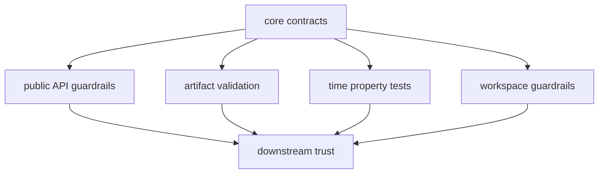

# Test Strategy

The test strategy in `bijux-gnss-core` is narrow by family and high in
amplification.

## Proof Flow

## Main Test Families

| family | protects | first proof |
| --- | --- | --- |
| public API guardrails | curated `bijux_gnss_core::api` export boundary | `tests/public_api_guardrail.rs` |
| artifact payload validation | semantic coherence of persisted acquisition, tracking, observation, navigation, and support records | `tests/nav_artifact_validation.rs`, `tests/tracking_artifact_validation.rs` |
| timekeeping properties | GPS, UTC, TAI, leap-second, and sample-trace conversions | `tests/prop_timekeeping.rs` and regression corpus |
| layering guardrails | core remains dependency-light and foundational | `tests/integration_guardrails.rs` |

## Strategy Rule

Tests here should prove contract stability, not duplicate runtime behavior from
higher-level crates. If a test reads like receiver orchestration or navigation
policy, the stronger owner is probably elsewhere.

## Review Checks

- Does the test protect shared meaning rather than one caller's convenience?
- Would a downstream crate or persisted artifact become ambiguous without this
  test?
- Is the proof close to the contract family it protects?
- Does failure explain the contract that moved, not only the code path that
  changed?
- Should a runtime, navigation, signal, infra, or command crate own the behavior
  instead?

## First Proof Check

Inspect `crates/bijux-gnss-core/tests/public_api_guardrail.rs`,
`crates/bijux-gnss-core/tests/nav_artifact_validation.rs`,
`crates/bijux-gnss-core/tests/tracking_artifact_validation.rs`,
`crates/bijux-gnss-core/tests/prop_timekeeping.rs`,
`crates/bijux-gnss-core/tests/prop_timekeeping.proptest-regressions`, and
`crates/bijux-gnss-core/tests/integration_guardrails.rs`.
