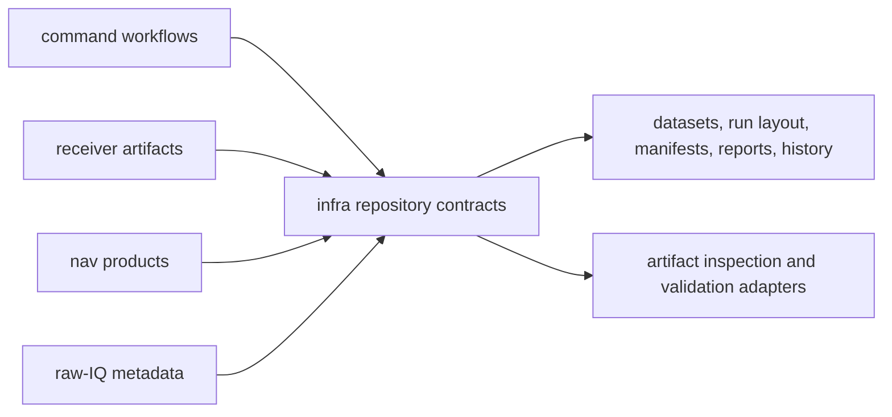

# Architecture Risks

The biggest structural risk in `bijux-gnss-infra` is honest overreach. The
crate sits at a legitimate aggregation boundary, so almost every convenience
argument sounds plausible.

## Risk Map

Infra owns repository state and inspection after product behavior has produced
data. It should not redefine the product meaning that command, receiver, nav,
signal, or core crates own.

## Highest-Risk Changes

- glue-bucket growth: unrelated helpers pile in because the crate already
  touches many surfaces
- boundary confusion: payload meaning from core or runtime behavior from
  receiver gets silently redefined here
- hidden command policy: command-specific workflow choices harden into
  repository contracts
- unstable persisted footprint: manifests, reports, or histories drift without
  being treated as durable contracts
- validation overclaim: repository-side checks are presented as end-to-end
  scientific proof

## Review Triage

| change shape | risk to inspect | better destination when it is not infra-owned |
| --- | --- | --- |
| dataset or capture metadata | signal or receiver behavior gets encoded as repository policy | `bijux-gnss-signal` or `bijux-gnss-receiver` |
| manifest, report, or history field | product semantics move into persistence naming | product owner plus `bijux-gnss-core` for shared records |
| artifact inspection | producer-owned meaning is reinterpreted after persistence | producing crate or `bijux-gnss-core` payload validation |
| override or sweep behavior | command UX or experiment policy becomes hidden infra behavior | command owner or explicit experiment contract |
| validation adapter | validation result is treated as full product proof | receiver, nav, or command proof in addition to infra proof |

## Proof To Request

- `crates/bijux-gnss-infra/docs/ARCHITECTURE.md` for module and ownership
  shape.
- `crates/bijux-gnss-infra/docs/CONTRACTS.md` for repository contract family.
- `crates/bijux-gnss-infra/docs/RUN_LAYOUT.md` for persisted footprint
  changes.
- `crates/bijux-gnss-infra/docs/DATASETS.md` for dataset and capture
  provenance changes.
- `crates/bijux-gnss-infra/tests/integration_guardrails.rs` for layering
  guardrails.

Reject infra changes that are only justified by "many callers need it." The
question is whether many callers need the same repository-state interpretation.
