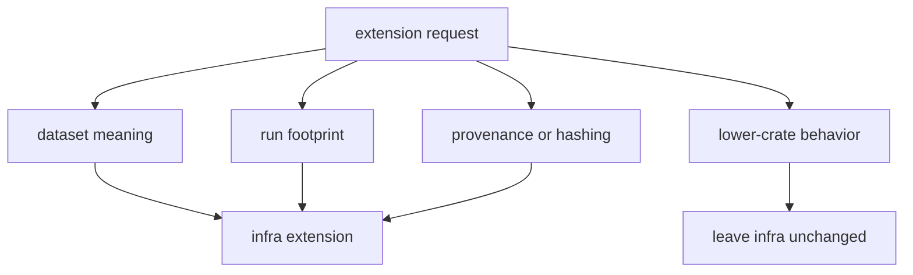

# Extensibility Model

`bijux-gnss-infra` should extend by deepening named repository contracts rather
than by adding broad utility surfaces.

Infra extensions are justified when repository evidence becomes more explicit:
dataset identity, run footprint, provenance, overrides, experiments, or
artifact inspection. They are not justified by a caller wanting a convenient
wrapper around receiver, signal, or navigation behavior.

## Preferred Extension Paths

- extend `datasets/` when repository-side metadata interpretation grows
- extend `run_layout/` when persisted footprint rules become richer
- extend `overrides/` and `sweep.rs` when reproducible variation gains typed
  cases
- extend `artifact_inspection/` or `validate_reference.rs` when persisted
  evidence workflows need clearer repository ownership

## Extension Smells

- new helper with no durable dataset, layout, validation, or provenance owner
- wrapping a lower-level API unchanged and calling that infrastructure
- storing command-specific policy as a general repository contract
- adding a persisted field without explaining who will read it after the
  producing command changes
- treating experiment convenience as repository truth before the sweep shape is
  deterministic

## Decision Table

| proposed extension | belongs in infra when |
| --- | --- |
| dataset metadata field | it changes repository-side interpretation or capture provenance |
| run directory or manifest field | it changes the persisted evidence contract |
| override key | it mutates a receiver profile through typed, reviewable policy |
| experiment axis | it expands deterministically into named run configurations |
| artifact inspection output | it explains persisted evidence without redefining producer meaning |

## Proof Path

Start with the [infra contract guide](../../../crates/bijux-gnss-infra/docs/CONTRACTS.md)
and the infra guardrail test. If the change persists data, also read the
[run layout guide](../../../crates/bijux-gnss-infra/docs/RUN_LAYOUT.md) before
accepting the extension.
