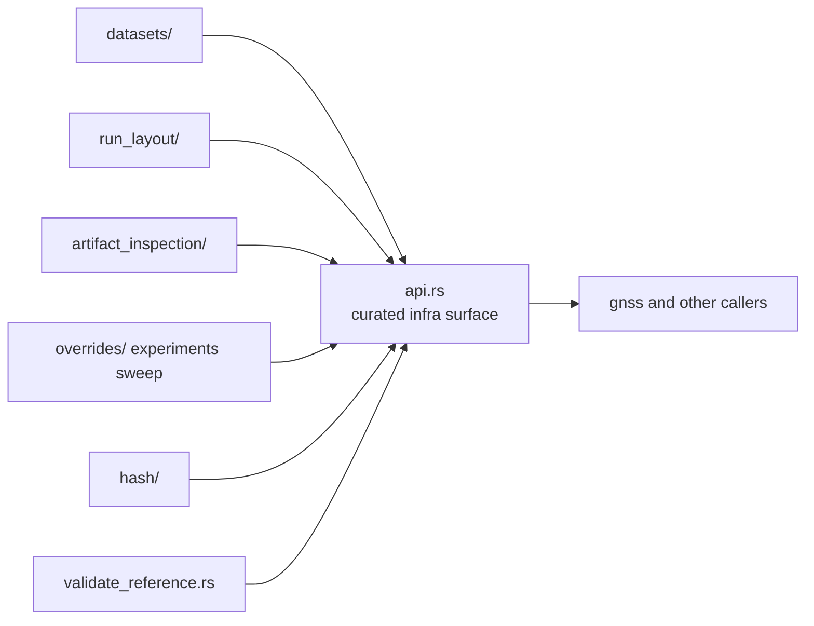

# Architecture

Open this section when the question is structural: where datasets, run layout,
artifact inspection, overrides, hashing, and validation adapters live in code,
and how the crate avoids becoming a generic glue bucket.

## Structural Shape

`bijux-gnss-infra` is not a single pipeline. It is a set of repository-facing
subsystems with explicit responsibilities: dataset interpretation, run
footprint management, artifact interrogation, reproducibility evidence, and
typed configuration variation.

## Read These First

- open [Module Map](module-map.md) first when you need the fastest route from a
  repository concern to the owning code area
- open [Dependency Direction](dependency-direction.md) when the question is
  whether the crate is aggregating lower-level APIs honestly
- open [State and Persistence](state-and-persistence.md) when the issue is run
  footprint durability rather than one helper implementation

## First Proof Check

- `crates/bijux-gnss-infra/src/datasets/`
- `crates/bijux-gnss-infra/src/run_layout/`
- `crates/bijux-gnss-infra/src/artifact_inspection/`
- `crates/bijux-gnss-infra/docs/ARCHITECTURE.md`

## Pages In This Section

- [Module Map](module-map.md)
- [Dependency Direction](dependency-direction.md)
- [Execution Model](execution-model.md)
- [State and Persistence](state-and-persistence.md)
- [Integration Seams](integration-seams.md)
- [Error Model](error-model.md)
- [Extensibility Model](extensibility-model.md)
- [Code Navigation](code-navigation.md)
- [Architecture Risks](architecture-risks.md)

## Leave This Section When

- leave for [Foundation](../foundation/) when the real disagreement is still
  about ownership rather than structure
- leave for [Interfaces](../interfaces/) when the structural question is
  already about manifest or dataset contract shape
- leave for [Quality](../quality/) when the structure is clear and the next
  question is proof
