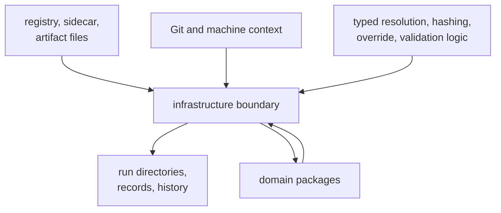

# Infrastructure Architecture Guide

`bijux-gnss-infra` is a set of repository-facing subsystems, not a scientific
pipeline. Dataset resolution, run identity, persisted records, provenance,
artifact inspection, typed variation, and reference adaptation each own a
different part of the evidence lifecycle.

## Repository Evidence Architecture

```mermaid
flowchart LR
    caller["command, test, or tool"]
    dataset["dataset and sidecar<br/>resolution"]
    variation["typed overrides<br/>and sweeps"]
    identity["run identity<br/>and provenance"]
    owner["scientific execution"]
    records["typed domain records"]
    persistence["manifest, report,<br/>artifacts, history"]
    inspection["inspection, comparison,<br/>or replay"]

    caller --> dataset --> variation --> identity --> owner
    owner --> records --> persistence --> inspection
```

Infrastructure owns the stages around scientific execution. Receiver, signal,
and navigation packages remain responsible for the records they produce and the
claims those records support.

## Find The Structural Owner

| concern | architecture route | responsibility |
| --- | --- | --- |
| Registry entries, sidecars, coordinates, or capture provenance | [Module map](module-map.md) | turn repository declarations into typed inputs without guessing |
| Run location, identity, manifests, reports, history, or artifact headers | [State and persistence](state-and-persistence.md) | preserve a durable execution footprint |
| Order of preparation, variation, persistence, and later inspection | [Execution model](execution-model.md) | compose repository state around domain execution |
| Dependency on core, signal, receiver, navigation, or command packages | [Dependency direction](dependency-direction.md) | adapt lower contracts without importing command policy |
| Artifact explanation, validation, or reference alignment | [Integration seams](integration-seams.md) | interrogate persisted evidence without rerunning science |
| Input, schema, persistence, or adaptation failure | [Error model](error-model.md) | preserve whether evidence was unreadable, invalid, or scientifically refused |
| New repository-owned subsystem | [Extensibility model](extensibility-model.md) | require a durable object and explicit effects |
| Mixed ownership or generic glue | [Architecture risks](architecture-risks.md) | reject convenience that obscures the real owner |

## Effects Stay At The Repository Boundary

Filesystem access, repository discovery, build context, and durable writes
belong at explicit infrastructure seams. Domain packages should receive typed
inputs and return typed records rather than opening repository files or
assembling run paths.

## Identity Before Placement

A run path is the result of declared context, not the identity itself. Resume
targets and explicit output locations affect placement; configuration, dataset,
command, build, and determinism context explain attribution. Callers must use
the run-layout contract instead of constructing child paths independently.

This distinction matters during replay and comparison: identical directory
names do not prove equivalent inputs, and different locations do not
necessarily mean different scientific conditions.

## Inspection Is Not Re-execution

Artifact inspection can identify a kind, parse records, apply schema and
payload checks, detect sequence problems, and summarize diagnostics. It cannot
recreate receiver state or prove navigation accuracy. Reference adaptation can
align persisted solutions with supplied epochs; navigation owns the resulting
scientific interpretation.

## Implementation Evidence

Use [code navigation](code-navigation.md) after identifying the subsystem. The
implementation authorities are the
[dataset boundary](../../../crates/bijux-gnss-infra/src/datasets/mod.rs),
[run-layout boundary](../../../crates/bijux-gnss-infra/src/run_layout.rs),
[artifact inspector](../../../crates/bijux-gnss-infra/src/artifact_inspection/mod.rs),
[override boundary](../../../crates/bijux-gnss-infra/src/overrides/mod.rs),
[provenance hasher](../../../crates/bijux-gnss-infra/src/hash/mod.rs), and
[reference adapter](../../../crates/bijux-gnss-infra/src/validate_reference.rs).

The [crate architecture](../../../crates/bijux-gnss-infra/docs/ARCHITECTURE.md)
states the package-level dependency and durability rules.
