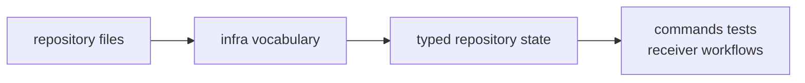

# Domain Language

The infrastructure crate has its own vocabulary, and it is different from the
signal, navigation, and receiver vocabularies nearby.

## Vocabulary Flow

## Vocabulary Families

| family | words mean | not the same as |
| --- | --- | --- |
| dataset | registry entries, capture metadata, sidecars, coordinates, and recorded provenance | receiver sample processing |
| run footprint | run identity, manifests, reports, directories, artifact headers, and history entries | command report wording |
| variation | common overrides, sweep parameters, experiment specs, and expanded cases | arbitrary profile mutation |
| validation | artifact inspection, validation summaries, and reference adapters | receiver runtime validation internals |
| provenance | config hashes, git state, CPU features, and reproducibility evidence | product science claims |

## Reader Standard

Infra looks like glue when the vocabulary is not named. Once the language is
explicit, the crate becomes easier to keep honest and harder to bloat with
unowned convenience helpers.

Ask these questions when adding infra vocabulary:

- Does this term describe repository state or a product algorithm?
- Can command, receiver, and tests use the same typed meaning?
- Does the term survive after the run that produced the evidence is gone?
- Is the lower owner still clear when infra re-exports a public API?
- Is provenance attached before a reviewer needs to trust the result?

## First Proof Check

Inspect `crates/bijux-gnss-infra/src/datasets/`,
`crates/bijux-gnss-infra/src/run_layout/`,
`crates/bijux-gnss-infra/src/overrides/`,
`crates/bijux-gnss-infra/src/hash/`,
`crates/bijux-gnss-infra/src/artifact_inspection/`, and
`crates/bijux-gnss-infra/docs/CONTRACTS.md`.
