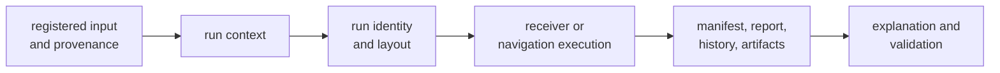
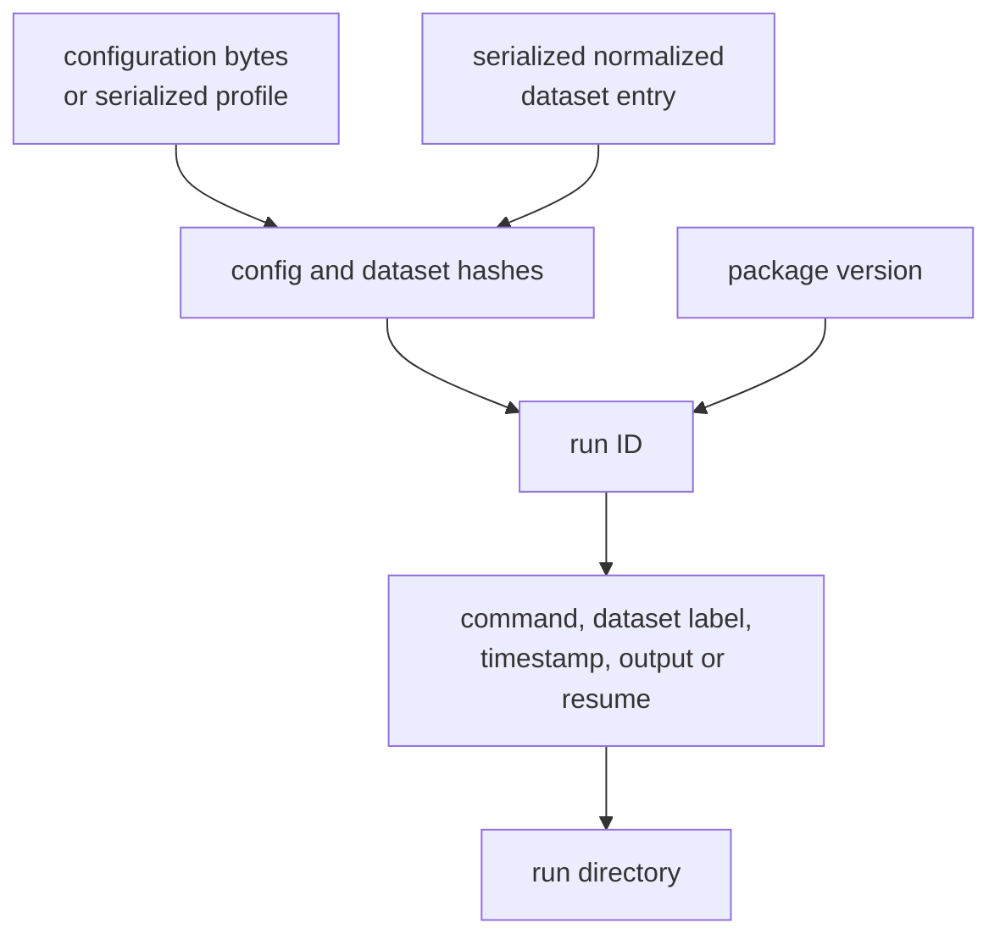
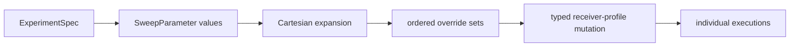

# Infrastructure Domain Language

`bijux-gnss-infra` gives repository state a typed meaning. Its terms describe
where inputs came from, how one execution was identified, what was persisted,
and how a later reader can inspect that evidence. They do not rename signal
processing, receiver lifecycle, or navigation science as “infrastructure.”

## The Repository-State Flow

Each stage answers a different reader question:

- **registered input:** Which capture or scenario was selected, and what facts
  are recorded about it?
- **run context:** Which configuration, dataset choice, output behavior, and
  determinism request apply?
- **run identity:** Which stable inputs identify this execution?
- **run layout:** Where will its repository footprint be written?
- **records:** What was requested, built, observed, and summarized?
- **inspection:** Can a later reader decode the persisted payload and its
  diagnostics?

## Dataset Terms

| Term | Precise meaning | Do not use it to mean |
| --- | --- | --- |
| dataset registry | a TOML collection of version, entries, and repository-relative locations | a receiver scheduler or scientific catalog |
| dataset entry | one typed registration containing identity, capture location, sample facts, expectations, and optional recorded-capture provenance | the raw samples themselves |
| dataset ID | the lookup key stored in an entry and carried into run evidence | a content hash |
| capture location | the normalized location of the registered sample data | provenance or immutable identity |
| sidecar | an optional metadata document used to resolve raw-IQ interpretation | a generic companion file |
| raw-IQ metadata | format, sample rate, intermediate frequency, capture start, offset, quantization depth, and notes | dataset attribution or receiver configuration |
| recorded-capture provenance | source URL, license, attribution, hardware, center frequency, and recommended configuration when known | proof that the capture is scientifically valid |
| expected satellites, region, or time | registry expectations useful to validation and readers | guaranteed receiver output |

Relative capture, sidecar, and recommended-configuration locations are
normalized against the registry location when loaded. The resulting strings are
resolved locations, not the original spelling from the registry.

When both a registry entry and sidecar can provide raw-IQ metadata,
infrastructure compares format, sample rate, intermediate frequency, and capture
start. Successful resolution means those shared facts agree; it does not mean
all optional metadata or the capture contents were independently verified.

## Run Identity and Location

Identity and location are related but not interchangeable.

| Term | Meaning |
| --- | --- |
| config hash | SHA-256 of explicit configuration-file bytes, or of the serialized receiver profile when no file is supplied |
| dataset hash | SHA-256 of the serialized, already normalized `DatasetEntry` |
| run ID | SHA-256 over config hash, optional dataset hash, and package version |
| run context | arguments controlling configuration, dataset choice, unregistered input, output override, resume, deterministic mode, and sidecar |
| run directory | the selected filesystem root for one execution |
| run directory layout | typed locations for artifacts, logs, summary, and manifest beneath that root |

A run ID is content-derived from the inputs above. It does not include command
name, timestamp, Git state, or CPU features. A default non-deterministic run
directory adds dataset label, command, and timestamp around that ID. Explicit
output and resume locations can bypass the default naming shape. Do not infer
run identity by parsing a directory name.

## Persisted Record Terms

| Record | Reader purpose | Current contents |
| --- | --- | --- |
| run manifest | describe execution context and rich provenance | command, timestamp, Git state, configuration hash and snapshot, dataset data, build context, replay scope, front-end provenance, and summary |
| run report | identify the execution compactly | run ID, configuration and dataset hashes, build identity, layout version, replay scope, and front-end provenance |
| run history entry | discover executions through an append-only index | run location, command, timestamp, Git hash, dataset ID, configuration hash, and summary |
| artifact header | bind a scientific payload to its producer context | schema, producer, creation time, Git and configuration identity, dataset, toolchain, features, and deterministic/dirty state |
| artifact payload | acquisition, tracking, observation, or navigation data owned by lower crates | scientific records and diagnostics |

The manifest, report, and history entry are not aliases for the same object.
The manifest is the richest execution record; the report carries compact
identity and replay context; history is a discovery index. An artifact header
belongs to each wrapped scientific payload and uses the shared core schema.

### Provenance is evidence, not truth

**Build provenance** records version, Git state, build profile, toolchain, CPU
features, and enabled features. **Front-end provenance** records the sample
format when available, receiver sample rate and IF, capture start, quantization,
code-frequency basis, and the sources used to normalize or calibrate those
values. **Replay scope** records whether deterministic, resume, explicit output,
requested dataset, or unregistered-input behavior was selected.

These records help explain and reproduce a run. They do not establish the
physical accuracy of a capture, an orbit product, or a solution.

Likewise, `deterministic` means the deterministic path was requested and run
timestamps become zero. It does not, by itself, prove bit-for-bit reproducibility
across toolchains, CPU features, dependency versions, or external inputs.

## Variation Terms

| Term | Meaning |
| --- | --- |
| experiment specification | dataset or scenario ID, optional configuration, sweep parameters, optional seed, and optional output location |
| sweep parameter | one key and its ordered candidate values |
| sweep specification | the parsed collection of parameter keys and value lists |
| expanded case | one ordered set containing one value for every sweep parameter |
| override | a supported mutation applied to a typed receiver profile |
| common override | deterministic seed and deterministic-mode mutation shared by commands |

Expansion computes the Cartesian product. It does not validate that keys are
supported or values parse into the target field; typed application performs
that check and rejects unknown sweep keys. “Sweep” should not be used for an
arbitrary collection of hand-edited configurations whose expansion cannot be
reconstructed.

## Inspection and Validation Terms

| Term | Meaning |
| --- | --- |
| artifact kind | acquisition, tracking, observation, or position/navigation payload selected by explicit label or recognized filename |
| artifact explanation | header, entry count, and diagnostic-count summary for a recognized artifact |
| artifact validation | deserialization, current-schema check, payload validation, and collected diagnostics |
| strict validation | artifact validation that additionally rejects an empty file |
| reference validation | infrastructure entrypoint connecting repository inputs to lower-owned comparison logic |

Artifact validation is post-run evidence inspection. Receiver runtime validation
decides whether live state is usable; navigation integrity decides whether a
solution claim is supportable; signal validation checks reusable signal
contracts. Infrastructure must preserve those meanings rather than replacing
them with a generic pass/fail label.

## Ownership Tests

Use these distinctions when deciding where a new term belongs:

- If it describes modulation, code, frequency, or sample meaning, it belongs to
  signal.
- If it describes channel state, acquisition, tracking, or observation
  production, it belongs to receiver.
- If it describes products, corrections, estimation, or integrity, it belongs
  to navigation.
- If it describes registered inputs, repository locations, execution identity,
  persisted evidence, variation, provenance, or post-run inspection, it belongs
  to infrastructure.
- If it describes operator syntax or rendering, it belongs to the command
  package.

A convenience re-export does not transfer ownership. The type’s defining crate
continues to own its scientific or runtime semantics.

## Related Contracts

- [Infrastructure boundary](../../../crates/bijux-gnss-infra/docs/BOUNDARY.md)
  defines the package's repository-facing responsibility.
- [Dataset contract](../../../crates/bijux-gnss-infra/docs/DATASETS.md) explains
  registration, metadata resolution, and provenance.
- [Run layout contract](../../../crates/bijux-gnss-infra/docs/RUN_LAYOUT.md)
  describes the durable execution footprint.
- [Experiment contract](../../../crates/bijux-gnss-infra/docs/EXPERIMENTS.md)
  covers specifications and sweep expansion.
- [Validation boundary](../../../crates/bijux-gnss-infra/docs/VALIDATION.md)
  separates artifact inspection from lower-owned decisions.
