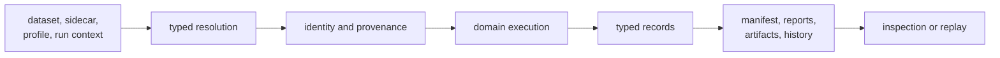
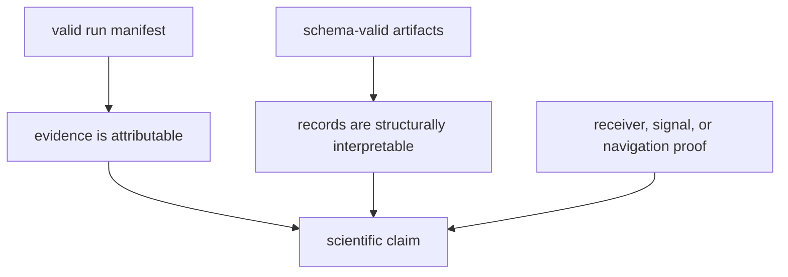

# Repository Evidence Foundations

`bijux-gnss-infra` turns declared inputs and runtime outputs into repository
evidence that another process can locate, attribute, and inspect. It owns
dataset resolution, run identity, layout, provenance, persisted manifests,
typed overrides, sweep expansion, and artifact inspection. It does not decide
whether a receiver lock or navigation solution is scientifically correct.

## Follow The Evidence

Infrastructure owns the path around domain execution, not the execution itself.
It resolves what will be used, prepares where evidence belongs, and preserves
what the producing crate returns.

## Start From The Repository Question

| question | contract |
| --- | --- |
| Which facts identify and describe a capture? | [Dataset contracts](../interfaces/dataset-contracts.md) |
| Where should a run and its evidence live? | [Run footprint contracts](../interfaces/run-footprint-contracts.md) |
| Why do two runs have matching or different identities? | [Provenance and hashing](../interfaces/provenance-and-hashing.md) |
| What may a profile override or experiment sweep change? | [Override and sweep contracts](../interfaces/override-and-sweep-contracts.md) |
| Can an existing artifact be identified, explained, and validated? | [Artifact inspection contracts](../interfaces/artifact-inspection-contracts.md) |
| Where does repository ownership stop? | [Ownership boundary](ownership-boundary.md) |

## What Infra Can Establish

Infrastructure can establish that:

- a dataset or sidecar supplied explicit capture metadata;
- a declared run context resolved to a governed footprint;
- configuration, dataset, build, repository, and front-end provenance were
  recorded according to the run contract;
- artifacts occupy the expected layout and conform to the selected schema and
  semantic inspection policy;
- typed overrides and sweep dimensions expanded deterministically.

Infrastructure alone cannot establish that a signal was truly present, a
tracking loop remained locked, an observation is physically accurate, or a
navigation result supports a positioning claim. Those conclusions require
evidence from the producing scientific package.

The lower two infrastructure conclusions are necessary for durable review, but
they are not sufficient for the scientific conclusion.

## Investigate A Broken Evidence Chain

| symptom | inspect first |
| --- | --- |
| The capture cannot be resolved | dataset identity, sidecar completeness, and explicit unregistered-dataset policy |
| The run appears in an unexpected location | resume target, output override, dataset context, and derived run identity |
| Two apparently identical runs differ | configuration hash, repository state, build context, dataset hash, and front-end provenance |
| An artifact exists without clear attribution | artifact header, run report, manifest, and history entry |
| A valid artifact supports no scientific conclusion | the producing receiver, signal, or navigation evidence |
| A persisted record is rejected by a newer reader | schema version, read policy, and compatibility rules before field values |

Do not repair these symptoms by assembling paths manually, rewriting manifests,
or weakening validation. Such changes break the evidence chain while making the
repository look superficially complete.

## Boundary Decisions

Use the [package overview](package-overview.md) for the concise package role,
[scope and non-goals](scope-and-non-goals.md) for explicit refusals, and
[dependencies and adjacencies](dependencies-and-adjacencies.md) for each
handoff. [Repository fit](repository-fit.md) explains why infrastructure sits
between commands and scientific packages, while
[change principles](change-principles.md) states the durability expectations
for persisted contracts.

Implementation evidence begins with the
[infrastructure contracts](../../../crates/bijux-gnss-infra/docs/CONTRACTS.md),
[dataset guide](../../../crates/bijux-gnss-infra/docs/DATASETS.md),
[run-layout guide](../../../crates/bijux-gnss-infra/docs/RUN_LAYOUT.md),
[hashing guide](../../../crates/bijux-gnss-infra/docs/HASHING.md), and
[validation guide](../../../crates/bijux-gnss-infra/docs/VALIDATION.md).
